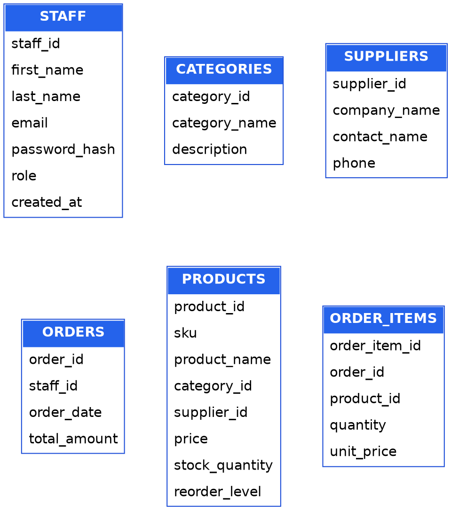
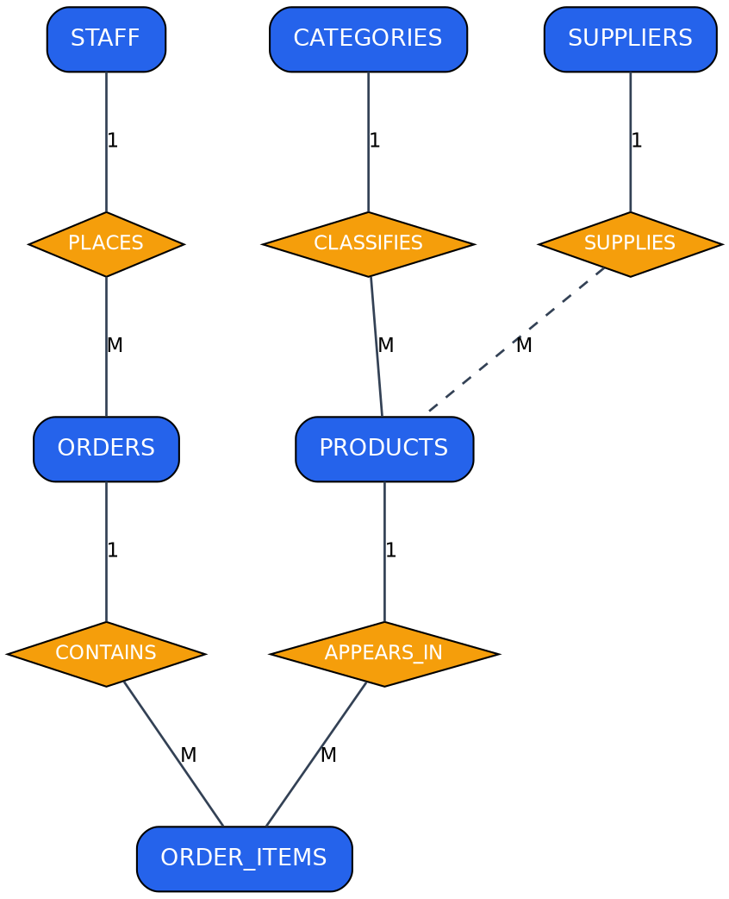
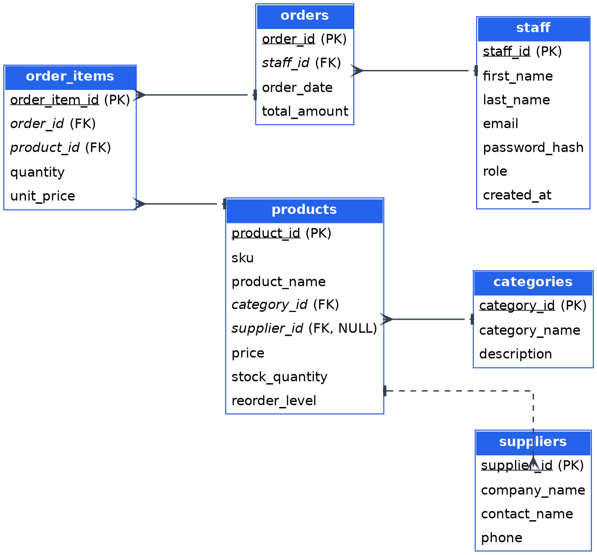
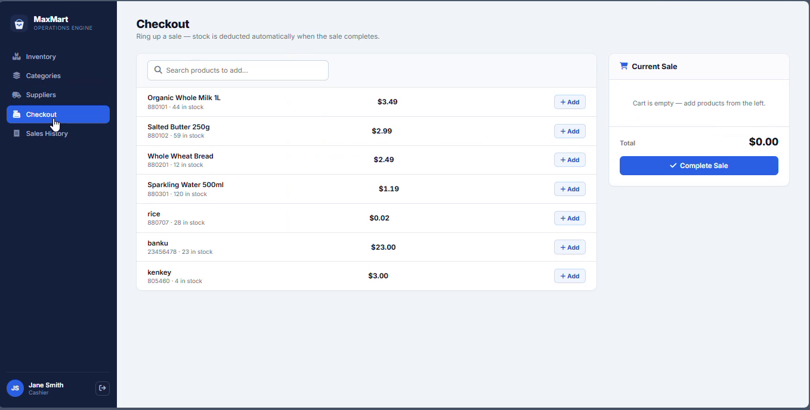
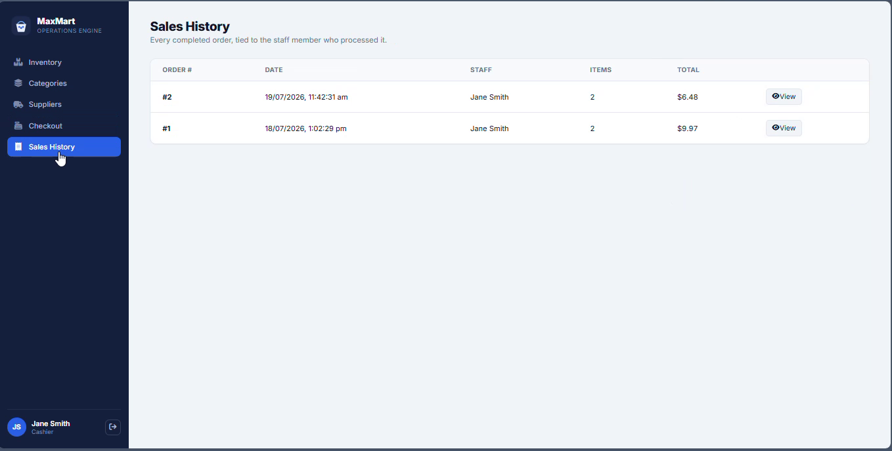
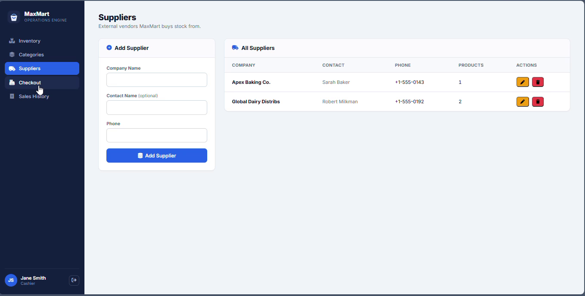

# MaxMart Operations System — Database Assignment

**DATABASE ASSIGNMENT**
Enterprise Database Design, Implementation & Web Integration

**Case Study: MaxMart Supermarket — Accra, Ghana**

### Group Members

- Donkor Shepherd Mensah — 2425404178
- Katumi Amadu — 2425401702
- Agyapong Epaphras Daleku Mawufemor — 2425401280
- Jason Amoah Nyarko — 2425402719
- Cornelius Tetteh Tetteh — 2425400662
- Dennis Adu Denkyira — 2425403696
- Kweku Nyamekye Sarfo-Mensah — 2425401408
- Nana Yaa Serwaa Acheampong — 2425401435

> **Login credentials (demo data):** `john.mngr@maxmart.com` or `jane.cash@maxmart.com` — password `password123`

---

## Table of Contents

- [Phase 1 — Business Requirements Specification](#phase-1--business-requirements-specification)
  - [1.1 Company Profile](#11-company-profile)
  - [1.2 Narrative of System Requirements](#12-narrative-of-system-requirements)
  - [1.3 Key Business Rules](#13-key-business-rules)
- [Phase 2 — Entity Types & Attribute Identification](#phase-2--entity-types--attribute-identification)
- [Phase 3 — Data Integrity and Constraints](#phase-3--data-integrity-and-constraints)
- [Phase 4 — Entity Type Schema Diagram](#phase-4--entity-type-schema-diagram)
- [Phase 5 — Conceptual Modelling — Entity-Relationship Diagram](#phase-5--conceptual-modelling--entity-relationship-diagram)
  - [5.1 Relationships, Cardinality & Participation Constraints](#51-relationships-cardinality--participation-constraints)
- [Phase 6 — Logical Relational Schema Diagram](#phase-6--logical-relational-schema-diagram)
  - [6.1 Referential Integrity Summary](#61-referential-integrity-summary)
- [Phase 7 — Physical Database Implementation & Population](#phase-7--physical-database-implementation--population)
  - [7.1 Data Definition Language (DDL) — schema.sql](#71-data-definition-language-ddl--schemasql)
  - [7.2 Data Manipulation Language (DML) — seed.sql](#72-data-manipulation-language-dml--seedsql)
- [Phase 8 — Web Interface Integration](#phase-8--web-interface-integration)
  - [8.1 Architecture Overview](#81-architecture-overview)
  - [8.2 Authentication & Sessions](#82-authentication--sessions)
  - [8.3 Frontend Application Shell](#83-frontend-application-shell)
  - [8.4 CRUD & Business-Process Mapping](#84-crud--business-process-mapping)
  - [8.5 Delete-Safety Behaviour](#85-delete-safety-behaviour)
  - [8.6 Checkout / Point-of-Sale Flow](#86-checkout--point-of-sale-flow)
  - [8.7 Live Dashboard Screenshots](#87-live-dashboard-screenshots)
  - [8.8 Security & Improvement Notes](#88-security--improvement-notes)
- [Conclusion](#conclusion)
- [Appendix A — Full Backend Source (api.php)](#appendix-a--full-backend-source-apiphp)
- [Appendix B — Full Frontend Source (index.html)](#appendix-b--full-frontend-source-indexhtml)

---

# Phase 1 — Business Requirements Specification

## 1.1 Company Profile

MaxMart Supermarket is a mid-sized, independently owned grocery retailer trading from a single storefront in Accra, Ghana. The store stocks a mix of imported packaged goods — dairy, bakery, and beverage lines — alongside locally sourced staples such as rice, banku mix, and kenkey, serving households in the surrounding neighbourhood. MaxMart currently employs a small team split across two roles: a store Manager who oversees pricing, stock, and supplier relationships, and Cashiers who process sales at the till.

As the business has grown beyond a handful of shelves, its owner has found that tracking stock levels, supplier relationships, and daily sales on paper ledgers and spreadsheets is no longer reliable — prices drift out of sync between the shelf and the till, low stock is not caught before a line runs out, and there is no single source of truth a Manager can query at the end of a trading day. MaxMart has therefore commissioned a relational database, backed by a simple internal web dashboard, so staff can view and update the product catalogue directly instead of editing spreadsheets by hand.

## 1.2 Narrative of System Requirements

Consultation with the store owner identified the following operational needs the system must support:

- **Staff accounts** — every employee who can access the system must be uniquely identifiable, assigned exactly one role (Manager or Cashier), and authenticated with a securely hashed password.
- **Category management** — every product sold must be grouped into a functional category (e.g. Dairy, Bakery, Beverages) so the Manager can review performance and shelf allocation by department.
- **Supplier tracking** — the business deals with multiple external suppliers and needs a record of each supplier's contact details, independent of which products they currently provide.
- **Product catalogue** — each product needs a unique SKU/barcode, a display name, a category, an optional supplier, a unit price, an on-hand stock count, and a reorder threshold.
- **Sales recording** — each completed sale must be captured as an order tied to the staff member who processed it, with individual line items recording the product sold, the quantity, and the price charged at the time of sale, so historical revenue figures stay accurate even if the catalogue price changes afterwards.
- **Operational reporting** — the Manager should be able to see, at a glance, how many distinct products are carried and the total number of units on hand, to plan reordering and shelf space.

## 1.3 Key Business Rules

The following business rules govern the integrity of MaxMart's data and are enforced directly at the database layer wherever possible, rather than relying on the application code alone:

- Every product must belong to exactly one category; a category cannot be removed while products still reference it.
- A supplier may be removed from the system without deleting the products they supply — those products simply become unassigned.
- No product may carry a negative price or a negative stock quantity, and no order line item may carry a negative quantity or unit price.
- SKUs, category names, and staff email addresses must each be unique across the system.
- A staff record cannot be deleted while it still has orders attached, preserving the audit trail of who processed each historical sale.
- Deleting an order deletes its line items with it, since a line item has no independent meaning once its parent order is gone.
- A product cannot be deleted while it appears in historical order line items, protecting past sales records from silently losing their meaning.
- Every staff member is assigned one of exactly two roles — Manager or Cashier — enforced by a domain check constraint.

# Phase 2 — Entity Types & Attribute Identification

Based on the requirements narrative above, six entity types were identified. At this stage attributes are listed by name only, ahead of the technical typing and constraint definition carried out in Phase 3.

| Entity Type | Attributes Identified |
|---|---|
| STAFF | staff_id, first_name, last_name, email, password_hash, role, created_at |
| CATEGORIES | category_id, category_name, description |
| SUPPLIERS | supplier_id, company_name, contact_name, phone |
| PRODUCTS | product_id, sku, product_name, category_id, supplier_id, price, stock_quantity, reorder_level |
| ORDERS | order_id, staff_id, order_date, total_amount |
| ORDER_ITEMS | order_item_id, order_id, product_id, quantity, unit_price |

ORDER_ITEMS is an associative (bridge) entity: it resolves the many-to-many relationship between a single order and the many products it can contain, while also carrying its own attributes (quantity, unit_price) that belong to the association itself rather than to either parent entity.

# Phase 3 — Data Integrity and Constraints

Every attribute identified in Phase 2 is given an explicit data type and constraint set below, exactly as implemented in the physical schema (see Phase 7).

### STAFF

| Attribute | Data Type | PK/FK | Null? | Additional Constraints |
|---|---|---|---|---|
| staff_id | INT | **PK** | NOT NULL | AUTO_INCREMENT |
| first_name | VARCHAR(50) | — | NOT NULL | — |
| last_name | VARCHAR(50) | — | NOT NULL | — |
| email | VARCHAR(100) | — | NOT NULL | UNIQUE |
| password_hash | VARCHAR(255) | — | NOT NULL | Stores a bcrypt hash, never plaintext |
| role | VARCHAR(20) | — | NOT NULL | CHECK (role IN ('Manager','Cashier')) |
| created_at | TIMESTAMP | — | NOT NULL | DEFAULT CURRENT_TIMESTAMP |

### CATEGORIES

| Attribute | Data Type | PK/FK | Null? | Additional Constraints |
|---|---|---|---|---|
| category_id | INT | **PK** | NOT NULL | AUTO_INCREMENT |
| category_name | VARCHAR(50) | — | NOT NULL | UNIQUE |
| description | TEXT | — | NULL | — |

### SUPPLIERS

| Attribute | Data Type | PK/FK | Null? | Additional Constraints |
|---|---|---|---|---|
| supplier_id | INT | **PK** | NOT NULL | AUTO_INCREMENT |
| company_name | VARCHAR(100) | — | NOT NULL | — |
| contact_name | VARCHAR(50) | — | NULL | — |
| phone | VARCHAR(20) | — | NOT NULL | — |

### PRODUCTS

| Attribute | Data Type | PK/FK | Null? | Additional Constraints |
|---|---|---|---|---|
| product_id | INT | **PK** | NOT NULL | AUTO_INCREMENT |
| sku | VARCHAR(50) | — | NOT NULL | UNIQUE |
| product_name | VARCHAR(100) | — | NOT NULL | — |
| category_id | INT | *FK* | NOT NULL | REFERENCES categories(category_id) ON DELETE RESTRICT |
| supplier_id | INT | *FK* | NULL | REFERENCES suppliers(supplier_id) ON DELETE SET NULL |
| price | DECIMAL(10,2) | — | NOT NULL | CHECK (price >= 0.00) |
| stock_quantity | INT | — | NOT NULL | DEFAULT 0, CHECK (stock_quantity >= 0) |
| reorder_level | INT | — | NOT NULL | DEFAULT 10 |

### ORDERS

| Attribute | Data Type | PK/FK | Null? | Additional Constraints |
|---|---|---|---|---|
| order_id | INT | **PK** | NOT NULL | AUTO_INCREMENT |
| staff_id | INT | *FK* | NOT NULL | REFERENCES staff(staff_id) ON DELETE RESTRICT |
| order_date | DATETIME | — | NOT NULL | DEFAULT CURRENT_TIMESTAMP |
| total_amount | DECIMAL(10,2) | — | NOT NULL | DEFAULT 0.00, CHECK (total_amount >= 0.00) |

### ORDER_ITEMS

| Attribute | Data Type | PK/FK | Null? | Additional Constraints |
|---|---|---|---|---|
| order_item_id | INT | **PK** | NOT NULL | AUTO_INCREMENT |
| order_id | INT | *FK* | NOT NULL | REFERENCES orders(order_id) ON DELETE CASCADE |
| product_id | INT | *FK* | NOT NULL | REFERENCES products(product_id) ON DELETE RESTRICT |
| quantity | INT | — | NOT NULL | CHECK (quantity > 0) |
| unit_price | DECIMAL(10,2) | — | NOT NULL | CHECK (unit_price >= 0.00) |

# Phase 4 — Entity Type Schema Diagram

The diagram below shows the six entity types identified in Phase 2 as isolated structures, before any relationships are drawn between them — each box lists an entity's own attributes only.



*Figure 1 — Isolated entity types with their attributes, prior to relationship modelling.*

# Phase 5 — Conceptual Modelling — Entity-Relationship Diagram

The Entity-Relationship diagram below (Chen notation) connects the six entities via five relationships, with cardinality (1 or M) marked on each connecting line.



*Figure 2 — Conceptual ER diagram showing entities (rectangles), relationships (diamonds), and cardinalities.*

## 5.1 Relationships, Cardinality & Participation Constraints

| Relationship | Entities Involved | Cardinality | Left Participation | Right Participation |
|---|---|---|---|---|
| Places | STAFF → ORDERS | 1 : M | Partial | Total |
| Contains | ORDERS → ORDER_ITEMS | 1 : M | Partial | Total |
| Appears In | PRODUCTS → ORDER_ITEMS | 1 : M | Partial | Total |
| Classifies | CATEGORIES → PRODUCTS | 1 : M | Partial | Total |
| Supplies | SUPPLIERS → PRODUCTS | 1 : M (optional) | Partial | Partial |

"Total" participation means every instance of that entity must take part in the relationship (e.g. every order must have been placed by a staff member — staff_id is NOT NULL). "Partial" participation means an instance may legitimately exist without taking part (e.g. a staff member may not yet have processed any order, and — because supplier_id is nullable — a product may exist with no linked supplier).

# Phase 6 — Logical Relational Schema Diagram

The conceptual ER model was translated into a logical relational schema. Each entity became a table; primary keys are underlined and foreign keys are italicised. Arrows use crow's-foot notation, running from the many (crow's-foot) side to the one (single tick) side, to show referential integrity between foreign keys and the primary keys they reference.



*Figure 3 — Logical relational schema with primary/foreign keys and referential integrity arrows.*

## 6.1 Referential Integrity Summary

| Foreign Key | Child Table | Parent Table | On Delete | Rationale |
|---|---|---|---|---|
| category_id | products | categories | RESTRICT | Prevents orphaned products if a category still in use is removed. |
| supplier_id | products | suppliers | SET NULL | Lets a supplier relationship end without deleting the product. |
| staff_id | orders | staff | RESTRICT | Preserves the audit trail of who processed historical sales. |
| order_id | order_items | orders | CASCADE | A line item has no meaning once its parent order is removed. |
| product_id | order_items | products | RESTRICT | Protects historical sales records from referencing a deleted product. |

# Phase 7 — Physical Database Implementation & Population

The logical and relational design above was implemented on MySQL (InnoDB storage engine). InnoDB was chosen specifically because it enforces foreign-key constraints and supports transactions — both required by the business rules in Phase 1 — unlike the older MyISAM engine, which silently ignores foreign keys.

## 7.1 Data Definition Language (DDL) — schema.sql

The complete table-creation script, including every constraint documented in Phase 3 (full file: [`schema.sql`](schema.sql)):

```sql
CREATE DATABASE IF NOT EXISTS supermarket_db;
USE supermarket_db;

-- 1. Staff Table
CREATE TABLE staff (
    staff_id INT AUTO_INCREMENT PRIMARY KEY,
    first_name VARCHAR(50) NOT NULL,
    last_name VARCHAR(50) NOT NULL,
    email VARCHAR(100) NOT NULL UNIQUE,
    password_hash VARCHAR(255) NOT NULL,
    role VARCHAR(20) NOT NULL CHECK (role IN ('Manager', 'Cashier')),
    created_at TIMESTAMP DEFAULT CURRENT_TIMESTAMP
) ENGINE=InnoDB;

-- 2. Categories Table
CREATE TABLE categories (
    category_id INT AUTO_INCREMENT PRIMARY KEY,
    category_name VARCHAR(50) NOT NULL UNIQUE,
    description TEXT NULL
) ENGINE=InnoDB;

-- 3. Suppliers Table
CREATE TABLE suppliers (
    supplier_id INT AUTO_INCREMENT PRIMARY KEY,
    company_name VARCHAR(100) NOT NULL,
    contact_name VARCHAR(50) NULL,
    phone VARCHAR(20) NOT NULL
) ENGINE=InnoDB;

-- 4. Products Table
CREATE TABLE products (
    product_id INT AUTO_INCREMENT PRIMARY KEY,
    sku VARCHAR(50) NOT NULL UNIQUE,
    product_name VARCHAR(100) NOT NULL,
    category_id INT NOT NULL,
    supplier_id INT NULL,
    price DECIMAL(10,2) NOT NULL CHECK (price >= 0.00),
    stock_quantity INT NOT NULL DEFAULT 0 CHECK (stock_quantity >= 0),
    reorder_level INT NOT NULL DEFAULT 10,
    FOREIGN KEY (category_id) REFERENCES categories(category_id) ON DELETE RESTRICT,
    FOREIGN KEY (supplier_id) REFERENCES suppliers(supplier_id) ON DELETE SET NULL
) ENGINE=InnoDB;

-- 5. Orders Table
CREATE TABLE orders (
    order_id INT AUTO_INCREMENT PRIMARY KEY,
    staff_id INT NOT NULL,
    order_date DATETIME NOT NULL DEFAULT CURRENT_TIMESTAMP,
    total_amount DECIMAL(10,2) NOT NULL DEFAULT 0.00 CHECK (total_amount >= 0.00),
    FOREIGN KEY (staff_id) REFERENCES staff(staff_id) ON DELETE RESTRICT
) ENGINE=InnoDB;

-- 6. Order_Items Table (Associative Entity)
CREATE TABLE order_items (
    order_item_id INT AUTO_INCREMENT PRIMARY KEY,
    order_id INT NOT NULL,
    product_id INT NOT NULL,
    quantity INT NOT NULL CHECK (quantity > 0),
    unit_price DECIMAL(10,2) NOT NULL CHECK (unit_price >= 0.00),
    FOREIGN KEY (order_id) REFERENCES orders(order_id) ON DELETE CASCADE,
    FOREIGN KEY (product_id) REFERENCES products(product_id) ON DELETE RESTRICT
) ENGINE=InnoDB;
```

## 7.2 Data Manipulation Language (DML) — seed.sql

A representative set of mock operational data was inserted to exercise every table and relationship, including two staff members, three categories, two suppliers, four products, one sample order, and its two order line items. Both staff accounts share the password `password123`, stored as a genuine bcrypt hash (verified with PHP's `password_verify()`, not a placeholder string) so the login screen in Phase 8 works immediately against this seed data (full file: [`seed.sql`](seed.sql)):

```sql
USE supermarket_db;

-- Populate Staff
-- NOTE: both accounts share the password "password123" — this is a real, working
-- bcrypt hash (verified with PHP's password_verify), not a placeholder string.
INSERT INTO staff (first_name, last_name, email, password_hash, role) VALUES
('John', 'Doe', 'john.mngr@maxmart.com', '$2b$10$lOSnGwDkd47rc1QktNlOjuXL2wjDZ3Xyt34EK1h1DU6bvYkwbmjwW', 'Manager'),
('Jane', 'Smith', 'jane.cash@maxmart.com', '$2b$10$lOSnGwDkd47rc1QktNlOjuXL2wjDZ3Xyt34EK1h1DU6bvYkwbmjwW', 'Cashier');

-- Populate Categories
INSERT INTO categories (category_name, description) VALUES
('Dairy', 'Milk, butter, cheese, and yogurt items'),
('Bakery', 'Freshly baked breads, pastries, and cakes'),
('Beverages', 'Soft drinks, juices, coffee, and water');

-- Populate Suppliers
INSERT INTO suppliers (company_name, contact_name, phone) VALUES
('Global Dairy Distribs', 'Robert Milkman', '+1-555-0192'),
('Apex Baking Co.', 'Sarah Baker', '+1-555-0143');

-- Populate Products
INSERT INTO products (sku, product_name, category_id, supplier_id, price, stock_quantity, reorder_level) VALUES
('880101', 'Organic Whole Milk 1L', 1, 1, 3.49, 45, 15),
('880102', 'Salted Butter 250g', 1, 1, 2.99, 60, 20),
('880201', 'Whole Wheat Bread', 2, 2, 2.49, 12, 10),
('880301', 'Sparkling Water 500ml', 3, NULL, 1.19, 120, 30);

-- Populate a Sample Order
INSERT INTO orders (staff_id, total_amount) VALUES (2, 9.97);

-- Populate Order Items
INSERT INTO order_items (order_id, product_id, quantity, unit_price) VALUES
(1, 1, 2, 3.49),
(1, 2, 1, 2.99);
```

# Phase 8 — Web Interface Integration

A working browser dashboard was built and connected live to the database, so MaxMart staff can sign in, manage the full catalogue, and ring up sales without touching SQL directly. Following an initial review of this section, the interface was substantially extended: it now covers all six entities from the relational schema, not just products, and staff must authenticate before touching any data.

## 8.1 Architecture Overview

- **Frontend** — a single static page (`index.html`): a login screen plus a five-tab dashboard (Inventory, Categories, Suppliers, Checkout, Sales History), built with plain HTML, CSS, and JavaScript (fetch API) — no framework or build step.
- **Backend** — a PHP application layer (`api.php`) exposing an 18-action JSON API, acting as the bridge between the browser and the database.
- **Database driver** — PHP Data Objects (PDO) with the MySQL driver, using prepared statements throughout to bind user input safely and prevent SQL injection.
- **Session layer** — native PHP sessions authenticate every request after login; cookies are scoped HttpOnly and SameSite=Lax.

## 8.2 Authentication & Sessions

Signing in posts an email and password to the `login` action. The backend looks the staff member up by email and checks the password with PHP's `password_verify()` against the bcrypt hash stored in the `staff` table — the plaintext password is never compared directly, and the hash never leaves the server. On success, the session ID is regenerated (`session_regenerate_id()`) before the staff member's id, name, and role are written into the session, which guards against session-fixation attacks.

**Excerpt — verifying credentials (api.php)**

```php
$stmt = $conn->prepare("SELECT * FROM staff WHERE email = :email");
$stmt->execute([":email" => $email]);
$staff = $stmt->fetch(PDO::FETCH_ASSOC);

if (!$staff || !password_verify($pw, $staff['password_hash'])) {
    http_response_code(401);
    echo json_encode(["error" => "Incorrect email or password."]);
} else {
    session_regenerate_id(true);
    $_SESSION['staff_id'] = $staff['staff_id'];
    // ...store first_name, last_name, role in the session
}
```

Every action except `login`, `logout`, and `me` (a status check used on page load) calls a small `requireAuth()` guard first, which stops the request with a 401 response if no `staff_id` is present in the session:

**Excerpt — the auth guard applied to every protected action (api.php)**

```php
function requireAuth() {
    if (empty($_SESSION['staff_id'])) {
        http_response_code(401);
        echo json_encode(["error" => "You must be signed in to do this."]);
        exit();
    }
}
```

## 8.3 Frontend Application Shell

The dashboard is structured as a persistent sidebar (with the MaxMart logo, navigation between the five tabs, and the signed-in staff member's name/role) alongside a content area that swaps between panels entirely client-side — no page reloads. A single `api()` helper centralises every network call: it attaches credentials so the session cookie is sent, parses the JSON response, and throws a JavaScript error whenever the backend returns an error field, so every screen can handle failures with one try/catch pattern instead of repeating fetch boilerplate.

**Excerpt — the shared request helper (index.html)**

```javascript
async function api(action, { method = 'GET', body } = {}) {
    const url = `${API_URL}?action=${action}`;
    const opts = { method, credentials: 'include' };
    if (body !== undefined) {
        opts.headers = { 'Content-Type': 'application/json' };
        opts.body = JSON.stringify(body);
    }
    const res = await fetch(url, opts);
    const data = await res.json();
    if (data && data.error) throw new Error(data.error);
    return data;
}
```

Failed requests surface as dismissible toast notifications instead of blocking `alert()` dialogs, and the Inventory tab flags any product whose `stock_quantity` has fallen to or below its `reorder_level` with a "Low" badge — putting the `reorder_level` column (present in the schema since Phase 3, but unused by the original interface) to actual use.

## 8.4 CRUD & Business-Process Mapping

Products, categories, and suppliers each get the same four-action shape — list, add, update, delete — so the API surface stays predictable across resources:

| Resource | Read | Create | Update | Delete |
|---|---|---|---|---|
| Products | `get_products` | `add_product` | `update_product` | `delete_product` |
| Categories | `get_categories` | `add_category` | `update_category` | `delete_category` |
| Suppliers | `get_suppliers` | `add_supplier` | `update_supplier` | `delete_supplier` |

Authentication and sales sit outside that CRUD shape, since they represent actions and processes rather than plain records:

| Action | HTTP | Purpose |
|---|---|---|
| `login` | POST | Verifies email + password with `password_verify()`; starts the session. |
| `logout` | POST | Destroys the session. |
| `me` | GET | Reports whether a session is active — checked once on page load so a refresh doesn't force a re-login. |
| `get_orders` | GET | Lists past sales with the processing staff member's name and a line-item count. |
| `get_order_items` | GET | Line items for one order, used by the Sales History "View" detail modal. |
| `create_order` | POST | Transactional checkout — see Section 8.6. |

## 8.5 Delete-Safety Behaviour

Deletes are wrapped in try/catch so the RESTRICT and SET NULL foreign-key behaviour defined in Phase 3 surfaces as a readable message rather than a raw SQL error — for example, deleting a category that still has products assigned to it returns "Cannot delete this category — products are still assigned to it." instead of a MySQL constraint-violation string.

## 8.6 Checkout / Point-of-Sale Flow

The Checkout tab lets a signed-in staff member build a cart from the live product list and complete a sale, which both records the transaction and reduces stock — closing the loop between the ORDERS/ORDER_ITEMS tables (populated in Phase 7) and the PRODUCTS table.

The cart itself is ordinary client-side state; the integrity work happens once it is submitted. `create_order` wraps the whole operation in a single database transaction: quantities for the same product are first aggregated (so a product listed twice in one submission can't slip past validation as two smaller, individually-valid lines), then each product row is locked with `SELECT ... FOR UPDATE` while its stock is checked, and only once every line has been validated are the order, its line items, and the stock decrements written — any failure rolls the entire transaction back, so a sale can never be half-applied.

**Excerpt — validating and locking stock before committing a sale (api.php)**

```php
$conn->beginTransaction();

foreach ($aggregated as $productId => $qty) {
    // Lock the row so two simultaneous sales can't oversell the same stock.
    $stmt = $conn->prepare("SELECT ... FROM products WHERE product_id = :id FOR UPDATE");
    $stmt->execute([":id" => $productId]);
    $product = $stmt->fetch(PDO::FETCH_ASSOC);

    if ((int)$product['stock_quantity'] < $qty) {
        throw new Exception("Only {$product['stock_quantity']} unit(s) ... left in stock.");
    }
    // ... accumulate line total
}
// Only now: INSERT the order, INSERT each order_item, and decrement stock.
$conn->commit();
```

The order's `staff_id` is taken from the session rather than from anything the browser sends, so a sale is always attributed to whoever is actually signed in — directly satisfying the Phase 1 requirement that every sale be traceable to the staff member who processed it.

## 8.7 Live Dashboard Screenshots

The screenshots below are frames pulled directly from a screen recording of the system running against the real MySQL database (not a mock-up) — they show the Checkout flow, a completed sale immediately reflected in Sales History, and the Suppliers management tab.



*Figure 4 — Checkout tab: building a cart from live stock before completing a sale.*



*Figure 5 — Sales History showing Order #2, attributed to the signed-in staff member (Jane Smith), immediately after checkout.*



*Figure 6 — Suppliers tab, fully CRUD-managed rather than hardcoded.*

## 8.8 Security & Improvement Notes

The remaining production-readiness improvements identified are:

- The database connection still uses the root MySQL account with no password; a dedicated least-privilege application user should be created before any real deployment.
- Both Manager and Cashier roles are recorded and checked at login, but the API does not yet differentiate permissions between them — a signed-in Cashier can currently delete products or suppliers, actions a real deployment would likely restrict to Managers only.
- Login has no rate-limiting or lockout after repeated failed attempts, so brute-force protection is a good next addition.
- The session cookie's `secure` flag is currently `false` to work over plain HTTP on localhost; it should be switched to `true` once the site is served over HTTPS.

# Conclusion

This assignment took MaxMart Supermarket's stock-and-till problem through all eight phases of the database development lifecycle: a written requirements narrative, entity and attribute identification, fully typed integrity constraints, an isolated entity-type diagram, a conceptual ER model with cardinalities and participation constraints, a logical relational schema with referential integrity arrows, a physical MySQL implementation populated with representative data, and a working PHP/JavaScript dashboard.

The web layer reaches every table in the schema rather than just the product catalogue: staff sign in against the staff table before touching any data, categories and suppliers are fully manageable rather than hardcoded, and completing a sale in the Checkout tab is a real transaction against ORDERS and ORDER_ITEMS that also decrements stock — the business process the whole schema was designed around in Phase 1, not just its supporting catalogue data. What remains, documented honestly in Section 8.8 rather than glossed over, is permission differentiation between the Manager and Cashier roles the schema already distinguishes, and the usual pre-production hardening (a least-privilege database user, login rate-limiting, and HTTPS).

# Appendix A — Full Backend Source (api.php)

```php
<?php
// =====================================================================
// MaxMart Operations Engine — Backend API
// PHP + PDO (MySQL). Action-based router: ?action=... combined with the
// HTTP method. All responses are JSON.
//
// IMPORTANT: this file uses PHP sessions for login, which rely on cookies.
// Serve it over http:// (e.g. http://localhost/maxmart/) — opening
// index.html directly as a file:// URL will break the session cookie.
// =====================================================================

// --- 0. SESSION (must start before any output) ---
session_set_cookie_params([
    'lifetime' => 0,
    'path'     => '/',
    'secure'   => false,   // set true once served over HTTPS
    'httponly' => true,
    'samesite' => 'Lax',
]);
session_start();

// --- 1. CORS & PRE-FLIGHT HEADERS ---
// Origin is echoed back (rather than "*") because credentialed requests
// (cookies) are not allowed with a wildcard origin.
$origin = $_SERVER['HTTP_ORIGIN'] ?? '*';
header("Access-Control-Allow-Origin: $origin");
header("Access-Control-Allow-Credentials: true");
header("Content-Type: application/json; charset=UTF-8");
header("Access-Control-Allow-Methods: GET, POST, OPTIONS");
header("Access-Control-Allow-Headers: Content-Type, Access-Control-Allow-Headers, Authorization, X-Requested-With");

if ($_SERVER['REQUEST_METHOD'] === 'OPTIONS') {
    http_response_code(200);
    exit();
}

// --- 2. DATABASE CONFIGURATION ---
$host     = "localhost";
$db_name  = "supermarket_db";
$username = "root";
$password = "";
$conn     = null;

try {
    $conn = new PDO("mysql:host=" . $host . ";dbname=" . $db_name . ";charset=utf8mb4", $username, $password);
    $conn->setAttribute(PDO::ATTR_ERRMODE, PDO::ERRMODE_EXCEPTION);
} catch (PDOException $exception) {
    echo json_encode(["error" => "Connection error: " . $exception->getMessage()]);
    exit();
}

// --- 3. SMALL HELPERS ---

// Reads and decodes the JSON request body; always returns an array.
function input() {
    $raw = file_get_contents("php://input");
    $data = json_decode($raw, true);
    return is_array($data) ? $data : [];
}

// Blocks the request unless a staff member is signed in.
function requireAuth() {
    if (empty($_SESSION['staff_id'])) {
        http_response_code(401);
        echo json_encode(["error" => "You must be signed in to do this."]);
        exit();
    }
}

// The signed-in staff member's public info, or null.
function currentStaff() {
    if (empty($_SESSION['staff_id'])) return null;
    return [
        "staff_id"   => $_SESSION['staff_id'],
        "first_name" => $_SESSION['first_name'],
        "last_name"  => $_SESSION['last_name'],
        "role"       => $_SESSION['role'],
    ];
}

$action = $_GET['action'] ?? '';
$method = $_SERVER['REQUEST_METHOD'];

// Catch every route in an output buffer so an unrecognised action never
// silently returns an empty (unparsable) response to the frontend.
ob_start();

// ======================================================================
// AUTH
// ======================================================================

if ($method === 'POST' && $action === 'login') {
    $data = input();
    $email = trim($data['email'] ?? '');
    $pw = (string)($data['password'] ?? '');

    if ($email === '' || $pw === '') {
        echo json_encode(["error" => "Enter both an email and a password."]);
    } else {
        try {
            $stmt = $conn->prepare("SELECT * FROM staff WHERE email = :email");
            $stmt->execute([":email" => $email]);
            $staff = $stmt->fetch(PDO::FETCH_ASSOC);

            if (!$staff || !password_verify($pw, $staff['password_hash'])) {
                http_response_code(401);
                echo json_encode(["error" => "Incorrect email or password."]);
            } else {
                session_regenerate_id(true);
                $_SESSION['staff_id']   = $staff['staff_id'];
                $_SESSION['first_name'] = $staff['first_name'];
                $_SESSION['last_name']  = $staff['last_name'];
                $_SESSION['role']       = $staff['role'];
                echo json_encode(["message" => "Signed in.", "staff" => currentStaff()]);
            }
        } catch (PDOException $e) {
            echo json_encode(["error" => "Login failed: " . $e->getMessage()]);
        }
    }
}

if ($method === 'POST' && $action === 'logout') {
    $_SESSION = [];
    session_destroy();
    echo json_encode(["message" => "Signed out."]);
}

if ($method === 'GET' && $action === 'me') {
    $staff = currentStaff();
    echo json_encode(["authenticated" => $staff !== null, "staff" => $staff]);
}

// ======================================================================
// PRODUCTS
// ======================================================================

if ($method === 'GET' && $action === 'get_products') {
    requireAuth();
    try {
        $query = "SELECT p.product_id, p.sku, p.product_name, p.category_id, c.category_name,
                         p.supplier_id, s.company_name AS supplier_name,
                         p.price, p.stock_quantity, p.reorder_level
                  FROM products p
                  JOIN categories c ON p.category_id = c.category_id
                  LEFT JOIN suppliers s ON p.supplier_id = s.supplier_id
                  ORDER BY p.product_id ASC";
        $stmt = $conn->prepare($query);
        $stmt->execute();
        echo json_encode($stmt->fetchAll(PDO::FETCH_ASSOC));
    } catch (PDOException $e) {
        echo json_encode(["error" => $e->getMessage()]);
    }
}

if ($method === 'POST' && $action === 'add_product') {
    requireAuth();
    $data = input();
    if (!empty($data['sku']) && !empty($data['product_name']) && !empty($data['category_id']) && isset($data['price']) && isset($data['stock_quantity'])) {
        try {
            $query = "INSERT INTO products (sku, product_name, category_id, supplier_id, price, stock_quantity, reorder_level)
                      VALUES (:sku, :product_name, :category_id, :supplier_id, :price, :stock_quantity, :reorder_level)";
            $stmt = $conn->prepare($query);
            $stmt->execute([
                ":sku"            => $data['sku'],
                ":product_name"   => $data['product_name'],
                ":category_id"    => $data['category_id'],
                ":supplier_id"    => !empty($data['supplier_id']) ? $data['supplier_id'] : null,
                ":price"          => $data['price'],
                ":stock_quantity" => $data['stock_quantity'],
                ":reorder_level"  => (isset($data['reorder_level']) && $data['reorder_level'] !== '') ? $data['reorder_level'] : 10,
            ]);
            echo json_encode(["message" => "Product added to the catalogue."]);
        } catch (PDOException $e) {
            echo json_encode(["error" => "Could not add product: " . $e->getMessage()]);
        }
    } else {
        echo json_encode(["error" => "Please fill in all required fields."]);
    }
}

if ($method === 'POST' && $action === 'update_product') {
    requireAuth();
    $data = input();
    if (!empty($data['product_id']) && !empty($data['sku']) && !empty($data['product_name']) && !empty($data['category_id']) && isset($data['price']) && isset($data['stock_quantity'])) {
        try {
            $query = "UPDATE products
                      SET sku = :sku, product_name = :product_name, category_id = :category_id,
                          supplier_id = :supplier_id, price = :price, stock_quantity = :stock_quantity,
                          reorder_level = :reorder_level
                      WHERE product_id = :product_id";
            $stmt = $conn->prepare($query);
            $stmt->execute([
                ":sku"            => $data['sku'],
                ":product_name"   => $data['product_name'],
                ":category_id"    => $data['category_id'],
                ":supplier_id"    => !empty($data['supplier_id']) ? $data['supplier_id'] : null,
                ":price"          => $data['price'],
                ":stock_quantity" => $data['stock_quantity'],
                ":reorder_level"  => (isset($data['reorder_level']) && $data['reorder_level'] !== '') ? $data['reorder_level'] : 10,
                ":product_id"     => $data['product_id'],
            ]);
            echo json_encode(["message" => "Product updated."]);
        } catch (PDOException $e) {
            echo json_encode(["error" => "Update failed: " . $e->getMessage()]);
        }
    } else {
        echo json_encode(["error" => "Missing parameters for update."]);
    }
}

if ($method === 'POST' && $action === 'delete_product') {
    requireAuth();
    $data = input();
    if (!empty($data['product_id'])) {
        try {
            $stmt = $conn->prepare("DELETE FROM products WHERE product_id = :product_id");
            $stmt->execute([":product_id" => $data['product_id']]);
            echo json_encode(["message" => "Product removed from the catalogue."]);
        } catch (PDOException $e) {
            echo json_encode(["error" => "Cannot delete this product — it is linked to past orders."]);
        }
    } else {
        echo json_encode(["error" => "Invalid product identifier."]);
    }
}

// ======================================================================
// CATEGORIES
// ======================================================================

if ($method === 'GET' && $action === 'get_categories') {
    requireAuth();
    try {
        $query = "SELECT c.category_id, c.category_name, c.description,
                         COUNT(p.product_id) AS product_count
                  FROM categories c
                  LEFT JOIN products p ON p.category_id = c.category_id
                  GROUP BY c.category_id, c.category_name, c.description
                  ORDER BY c.category_name ASC";
        $stmt = $conn->prepare($query);
        $stmt->execute();
        echo json_encode($stmt->fetchAll(PDO::FETCH_ASSOC));
    } catch (PDOException $e) {
        echo json_encode(["error" => $e->getMessage()]);
    }
}

if ($method === 'POST' && $action === 'add_category') {
    requireAuth();
    $data = input();
    if (!empty($data['category_name'])) {
        try {
            $stmt = $conn->prepare("INSERT INTO categories (category_name, description) VALUES (:name, :desc)");
            $stmt->execute([":name" => $data['category_name'], ":desc" => $data['description'] ?? null]);
            echo json_encode(["message" => "Category added."]);
        } catch (PDOException $e) {
            echo json_encode(["error" => "Could not add category (name may already exist): " . $e->getMessage()]);
        }
    } else {
        echo json_encode(["error" => "Category name is required."]);
    }
}

if ($method === 'POST' && $action === 'update_category') {
    requireAuth();
    $data = input();
    if (!empty($data['category_id']) && !empty($data['category_name'])) {
        try {
            $stmt = $conn->prepare("UPDATE categories SET category_name = :name, description = :desc WHERE category_id = :id");
            $stmt->execute([":name" => $data['category_name'], ":desc" => $data['description'] ?? null, ":id" => $data['category_id']]);
            echo json_encode(["message" => "Category updated."]);
        } catch (PDOException $e) {
            echo json_encode(["error" => "Update failed: " . $e->getMessage()]);
        }
    } else {
        echo json_encode(["error" => "Missing parameters for update."]);
    }
}

if ($method === 'POST' && $action === 'delete_category') {
    requireAuth();
    $data = input();
    if (!empty($data['category_id'])) {
        try {
            $stmt = $conn->prepare("DELETE FROM categories WHERE category_id = :id");
            $stmt->execute([":id" => $data['category_id']]);
            echo json_encode(["message" => "Category removed."]);
        } catch (PDOException $e) {
            echo json_encode(["error" => "Cannot delete this category — products are still assigned to it."]);
        }
    } else {
        echo json_encode(["error" => "Invalid category identifier."]);
    }
}

// ======================================================================
// SUPPLIERS
// ======================================================================

if ($method === 'GET' && $action === 'get_suppliers') {
    requireAuth();
    try {
        $query = "SELECT s.supplier_id, s.company_name, s.contact_name, s.phone,
                         COUNT(p.product_id) AS product_count
                  FROM suppliers s
                  LEFT JOIN products p ON p.supplier_id = s.supplier_id
                  GROUP BY s.supplier_id, s.company_name, s.contact_name, s.phone
                  ORDER BY s.company_name ASC";
        $stmt = $conn->prepare($query);
        $stmt->execute();
        echo json_encode($stmt->fetchAll(PDO::FETCH_ASSOC));
    } catch (PDOException $e) {
        echo json_encode(["error" => $e->getMessage()]);
    }
}

if ($method === 'POST' && $action === 'add_supplier') {
    requireAuth();
    $data = input();
    if (!empty($data['company_name']) && !empty($data['phone'])) {
        try {
            $stmt = $conn->prepare("INSERT INTO suppliers (company_name, contact_name, phone) VALUES (:cn, :ct, :ph)");
            $stmt->execute([
                ":cn" => $data['company_name'],
                ":ct" => $data['contact_name'] ?? null,
                ":ph" => $data['phone'],
            ]);
            echo json_encode(["message" => "Supplier added."]);
        } catch (PDOException $e) {
            echo json_encode(["error" => "Could not add supplier: " . $e->getMessage()]);
        }
    } else {
        echo json_encode(["error" => "Company name and phone are required."]);
    }
}

if ($method === 'POST' && $action === 'update_supplier') {
    requireAuth();
    $data = input();
    if (!empty($data['supplier_id']) && !empty($data['company_name']) && !empty($data['phone'])) {
        try {
            $stmt = $conn->prepare("UPDATE suppliers SET company_name = :cn, contact_name = :ct, phone = :ph WHERE supplier_id = :id");
            $stmt->execute([
                ":cn" => $data['company_name'],
                ":ct" => $data['contact_name'] ?? null,
                ":ph" => $data['phone'],
                ":id" => $data['supplier_id'],
            ]);
            echo json_encode(["message" => "Supplier updated."]);
        } catch (PDOException $e) {
            echo json_encode(["error" => "Update failed: " . $e->getMessage()]);
        }
    } else {
        echo json_encode(["error" => "Missing parameters for update."]);
    }
}

if ($method === 'POST' && $action === 'delete_supplier') {
    requireAuth();
    $data = input();
    if (!empty($data['supplier_id'])) {
        try {
            $stmt = $conn->prepare("DELETE FROM suppliers WHERE supplier_id = :id");
            $stmt->execute([":id" => $data['supplier_id']]);
            echo json_encode(["message" => "Supplier removed. Any linked products are now unassigned rather than deleted."]);
        } catch (PDOException $e) {
            echo json_encode(["error" => "Could not delete supplier: " . $e->getMessage()]);
        }
    } else {
        echo json_encode(["error" => "Invalid supplier identifier."]);
    }
}

// ======================================================================
// ORDERS / CHECKOUT
// ======================================================================

if ($method === 'GET' && $action === 'get_orders') {
    requireAuth();
    try {
        $query = "SELECT o.order_id, o.order_date, o.total_amount,
                         CONCAT(st.first_name, ' ', st.last_name) AS staff_name,
                         (SELECT COUNT(*) FROM order_items oi WHERE oi.order_id = o.order_id) AS item_count
                  FROM orders o
                  JOIN staff st ON o.staff_id = st.staff_id
                  ORDER BY o.order_date DESC, o.order_id DESC";
        $stmt = $conn->prepare($query);
        $stmt->execute();
        echo json_encode($stmt->fetchAll(PDO::FETCH_ASSOC));
    } catch (PDOException $e) {
        echo json_encode(["error" => $e->getMessage()]);
    }
}

if ($method === 'GET' && $action === 'get_order_items') {
    requireAuth();
    $orderId = $_GET['order_id'] ?? '';
    if (!empty($orderId)) {
        try {
            $query = "SELECT oi.order_item_id, oi.product_id, p.product_name, oi.quantity, oi.unit_price,
                             (oi.quantity * oi.unit_price) AS subtotal
                      FROM order_items oi
                      JOIN products p ON oi.product_id = p.product_id
                      WHERE oi.order_id = :id";
            $stmt = $conn->prepare($query);
            $stmt->execute([":id" => $orderId]);
            echo json_encode($stmt->fetchAll(PDO::FETCH_ASSOC));
        } catch (PDOException $e) {
            echo json_encode(["error" => $e->getMessage()]);
        }
    } else {
        echo json_encode(["error" => "Missing order identifier."]);
    }
}

// Completes a sale: validates stock, creates the order + its line items,
// and decrements stock — all inside a single transaction so a failure
// partway through leaves nothing half-applied.
if ($method === 'POST' && $action === 'create_order') {
    requireAuth();
    $data = input();
    $items = $data['items'] ?? [];

    if (empty($items) || !is_array($items)) {
        echo json_encode(["error" => "Add at least one product to the cart before completing the sale."]);
    } else {
        try {
            $conn->beginTransaction();

            // Aggregate quantities per product first, so the same product
            // listed twice in one submission can't slip past the stock
            // check by being validated as two smaller, individually-valid lines.
            $aggregated = [];
            foreach ($items as $item) {
                $productId = $item['product_id'] ?? null;
                $qty = (int)($item['quantity'] ?? 0);
                if (!$productId || $qty <= 0) {
                    throw new Exception("Every cart line needs a valid product and a quantity greater than zero.");
                }
                $aggregated[$productId] = ($aggregated[$productId] ?? 0) + $qty;
            }

            $lines = [];
            $total = 0;

            foreach ($aggregated as $productId => $qty) {
                // Lock the row so two simultaneous sales can't oversell the same stock.
                $stmt = $conn->prepare("SELECT product_id, product_name, price, stock_quantity FROM products WHERE product_id = :id FOR UPDATE");
                $stmt->execute([":id" => $productId]);
                $product = $stmt->fetch(PDO::FETCH_ASSOC);

                if (!$product) {
                    throw new Exception("One of the products in the cart no longer exists.");
                }
                if ((int)$product['stock_quantity'] < $qty) {
                    throw new Exception("Only {$product['stock_quantity']} unit(s) of \"{$product['product_name']}\" left in stock.");
                }

                $lines[] = [
                    "product_id" => $productId,
                    "quantity"   => $qty,
                    "unit_price" => $product['price'],
                ];
                $total += $qty * $product['price'];
            }

            $stmt = $conn->prepare("INSERT INTO orders (staff_id, total_amount) VALUES (:staff_id, :total)");
            $stmt->execute([":staff_id" => $_SESSION['staff_id'], ":total" => $total]);
            $orderId = $conn->lastInsertId();

            $itemStmt  = $conn->prepare("INSERT INTO order_items (order_id, product_id, quantity, unit_price) VALUES (:order_id, :product_id, :qty, :unit_price)");
            $stockStmt = $conn->prepare("UPDATE products SET stock_quantity = stock_quantity - :qty WHERE product_id = :id");

            foreach ($lines as $line) {
                $itemStmt->execute([
                    ":order_id"   => $orderId,
                    ":product_id" => $line['product_id'],
                    ":qty"        => $line['quantity'],
                    ":unit_price" => $line['unit_price'],
                ]);
                $stockStmt->execute([":qty" => $line['quantity'], ":id" => $line['product_id']]);
            }

            $conn->commit();
            echo json_encode(["message" => "Sale completed.", "order_id" => $orderId, "total_amount" => $total]);
        } catch (Exception $e) {
            $conn->rollBack();
            echo json_encode(["error" => $e->getMessage()]);
        }
    }
}

// --- 4. FALLBACK for an unrecognised method/action combination ---
$output = ob_get_clean();
if ($output === '') {
    http_response_code(404);
    echo json_encode(["error" => "Unknown action '$action' for method $method."]);
} else {
    echo $output;
}
```

# Appendix B — Full Frontend Source (index.html)

```html
<!DOCTYPE html>
<html lang="en">
<head>
<meta charset="UTF-8">
<meta name="viewport" content="width=device-width, initial-scale=1.0">
<title>MaxMart Operations Engine</title>
<link href="https://fonts.googleapis.com/css2?family=Inter:wght@300;400;500;600;700;800&display=swap" rel="stylesheet">
<link rel="stylesheet" href="https://cdnjs.cloudflare.com/ajax/libs/font-awesome/6.4.0/css/all.min.css">
<style>
    :root {
        --primary: #2563eb;
        --primary-hover: #1d4ed8;
        --primary-light: #eff6ff;
        --navy: #0f172a;
        --rail: #14213d;
        --rail-hover: #1c2c4f;
        --success: #10b981;
        --warning: #f59e0b;
        --danger: #ef4444;
        --danger-hover: #dc2626;
        --dark: #0f172a;
        --bg: #f1f5f9;
        --surface: #ffffff;
        --border: #e2e8f0;
        --text-muted: #64748b;
        --radius: 12px;
    }

    * { box-sizing: border-box; margin: 0; padding: 0; font-family: 'Inter', sans-serif; }
    html, body { height: 100%; }
    body { background-color: var(--bg); color: var(--dark); overflow: hidden; }
    button { font-family: inherit; cursor: pointer; }
    input, select, textarea { font-family: inherit; }
    ::selection { background: var(--primary-light); color: var(--primary-hover); }

    /* ---------- shared bits ---------- */
    .nums { font-variant-numeric: tabular-nums; }
    .eyebrow { text-transform: uppercase; letter-spacing: 0.09em; font-size: 0.72rem; font-weight: 700; color: var(--text-muted); }
    .hidden { display: none !important; }

    /* ================= LOGIN SCREEN ================= */
    #loginScreen {
        position: fixed; top: 0; right: 0; bottom: 0; left: 0; display: flex; align-items: center; justify-content: center;
        background:
            radial-gradient(circle at 15% 20%, rgba(37,99,235,0.25), transparent 45%),
            radial-gradient(circle at 85% 80%, rgba(29,78,216,0.22), transparent 45%),
            var(--navy);
        z-index: 500;
    }
    .login-card {
        background: var(--surface); width: 100%; max-width: 380px; border-radius: 18px;
        padding: 2.25rem 2.25rem 2rem; box-shadow: 0 24px 60px -12px rgba(0,0,0,0.45);
        text-align: center;
    }
    .login-card .logo-mark { margin: 0 auto 1.1rem; width: 64px; height: 64px; }
    .login-card h1 { font-size: 1.35rem; font-weight: 800; letter-spacing: -0.02em; }
    .login-card p.sub { color: var(--text-muted); font-size: 0.88rem; margin-top: 0.3rem; margin-bottom: 1.6rem; }
    .login-card .form-group { text-align: left; }
    #loginError {
        background: #fef2f2; color: #b91c1c; border: 1px solid #fecaca; border-radius: 8px;
        padding: 0.65rem 0.85rem; font-size: 0.83rem; margin-bottom: 1rem; text-align: left; display: none;
    }
    .login-hint { margin-top: 1.4rem; font-size: 0.76rem; color: var(--text-muted); line-height: 1.5; }
    .login-hint code { background: var(--bg); padding: 0.1rem 0.35rem; border-radius: 4px; font-size: 0.74rem; }

    /* ================= LOGO MARK ================= */
    .logo-mark { flex-shrink: 0; }
    .logo-mark svg { width: 100%; height: 100%; display: block; }

    /* ================= APP SHELL ================= */
    #appShell { display: flex; height: 100vh; }

    .sidebar {
        width: 248px; flex-shrink: 0; background: var(--rail); color: #cbd5e1;
        display: flex; flex-direction: column; padding: 1.4rem 1rem; overflow-y: auto;
    }
    .sidebar-brand { display: flex; align-items: center; gap: 0.7rem; padding: 0.3rem 0.5rem 1.5rem; }
    .sidebar-brand .logo-mark { width: 38px; height: 38px; }
    .sidebar-brand .brand-text h2 { color: #fff; font-size: 1.02rem; font-weight: 800; letter-spacing: -0.01em; line-height: 1.15; }
    .sidebar-brand .brand-text p { font-size: 0.68rem; color: #7d8bab; letter-spacing: 0.06em; text-transform: uppercase; margin-top: 0.15rem; }

    .nav-list { list-style: none; display: flex; flex-direction: column; gap: 0.2rem; margin-top: 0.5rem; }
    .nav-btn {
        display: flex; align-items: center; gap: 0.7rem; width: 100%; text-align: left;
        background: transparent; border: none; color: #a9b6d3; padding: 0.62rem 0.75rem;
        border-radius: 9px; font-size: 0.87rem; font-weight: 500; position: relative;
        transition: background 0.15s ease, color 0.15s ease;
    }
    .nav-btn i { width: 18px; text-align: center; color: #7d8bab; font-size: 0.92rem; transition: color 0.15s ease; }
    .nav-btn:hover { background: var(--rail-hover); color: #fff; }
    .nav-btn:hover i { color: #fff; }
    .nav-btn.active { background: var(--primary); color: #fff; }
    .nav-btn.active i { color: #fff; }

    .sidebar-spacer { flex: 1; }

    .user-card {
        border-top: 1px solid rgba(255,255,255,0.08); padding-top: 1rem; margin-top: 0.5rem;
        display: flex; align-items: center; gap: 0.65rem;
    }
    .user-avatar {
        width: 36px; height: 36px; border-radius: 50%; background: var(--primary);
        color: #fff; display: flex; align-items: center; justify-content: center;
        font-weight: 700; font-size: 0.82rem; flex-shrink: 0;
    }
    .user-meta { flex: 1; min-width: 0; }
    .user-meta .u-name { color: #fff; font-size: 0.85rem; font-weight: 600; white-space: nowrap; overflow: hidden; text-overflow: ellipsis; }
    .user-meta .u-role { font-size: 0.72rem; color: #7d8bab; }
    .signout-btn {
        background: transparent; border: 1px solid rgba(255,255,255,0.15); color: #a9b6d3;
        width: 30px; height: 30px; border-radius: 8px; flex-shrink: 0; display: flex; align-items: center; justify-content: center;
    }
    .signout-btn:hover { background: var(--danger); border-color: var(--danger); color: #fff; }

    /* ================= MAIN CONTENT ================= */
    .content { flex: 1; overflow-y: auto; padding: 2rem 2.5rem; }
    .tab-panel { display: none; }
    .tab-panel.active { display: block; }

    .page-head { margin-bottom: 1.6rem; }
    .page-head h1 { font-size: 1.5rem; font-weight: 800; letter-spacing: -0.02em; }
    .page-head p { color: var(--text-muted); font-size: 0.9rem; margin-top: 0.2rem; }

    /* ---------- stat cards ---------- */
    .stats-grid { display: grid; grid-template-columns: repeat(auto-fit, minmax(220px, 1fr)); gap: 1.25rem; margin-bottom: 1.75rem; }
    .stat-card {
        background: var(--surface); padding: 1.3rem 1.4rem; border-radius: var(--radius);
        border: 1px solid var(--border); display: flex; align-items: center; gap: 1rem;
    }
    .stat-icon {
        width: 42px; height: 42px; border-radius: 10px; display: flex; align-items: center; justify-content: center;
        font-size: 1.05rem; flex-shrink: 0;
    }
    .stat-info .eyebrow { margin-bottom: 0.15rem; }
    .stat-info p { font-size: 1.55rem; font-weight: 800; letter-spacing: -0.01em; }

    /* ---------- layout grids ---------- */
    .main-grid { display: grid; grid-template-columns: 340px 1fr; gap: 1.5rem; align-items: start; }
    @media (max-width: 1100px) { .main-grid { grid-template-columns: 1fr; } }

    .card { background: var(--surface); border-radius: var(--radius); box-shadow: 0 1px 2px rgba(15,23,42,0.04); border: 1px solid var(--border); overflow: hidden; }
    .card-header { padding: 1.1rem 1.4rem; border-bottom: 1px solid var(--border); background: #fafbfc; display: flex; align-items: center; justify-content: space-between; }
    .card-header h2 { font-size: 0.98rem; font-weight: 700; display: flex; align-items: center; gap: 0.55rem; }
    .card-header h2 i { color: var(--primary); font-size: 0.92rem; }
    .card-body { padding: 1.4rem; }

    .form-group { margin-bottom: 1.1rem; }
    label { display: block; margin-bottom: 0.4rem; font-size: 0.8rem; font-weight: 600; color: #475569; }
    .input-wrapper { position: relative; }
    .input-wrapper i { position: absolute; left: 0.9rem; top: 50%; transform: translateY(-50%); color: var(--text-muted); font-size: 0.85rem; }
    input, select, textarea {
        width: 100%; padding: 0.68rem 0.9rem 0.68rem 2.35rem; border: 1px solid #cbd5e1; border-radius: 8px; font-size: 0.9rem;
        background: #fff; transition: border-color 0.15s ease, box-shadow 0.15s ease;
    }
    input:focus, select:focus, textarea:focus { outline: none; border-color: var(--primary); box-shadow: 0 0 0 3px rgba(37,99,235,0.12); }
    select { padding-left: 2.35rem; appearance: none; }
    textarea.input-plain, input.input-plain { padding-left: 0.9rem; }

    .btn { background: var(--primary); color: #fff; border: none; padding: 0.72rem 1.1rem; width: 100%;
        border-radius: 8px; font-weight: 600; font-size: 0.9rem; display: flex; align-items: center; justify-content: center; gap: 0.5rem; }
    .btn:hover { background: var(--primary-hover); }
    .btn-secondary { background: #64748b; }
    .btn-secondary:hover { background: #475569; }
    .btn-outline { background: transparent; border: 1px solid var(--border); color: var(--dark); }
    .btn-outline:hover { background: var(--bg); }

    .search-container { padding: 0.9rem 1.4rem; background: #f8fafc; border-bottom: 1px solid var(--border); }
    .search-wrapper { position: relative; max-width: 380px; }
    .search-wrapper i { position: absolute; left: 0.9rem; top: 50%; transform: translateY(-50%); color: var(--text-muted); }

    table { width: 100%; border-collapse: collapse; text-align: left; font-size: 0.87rem; }
    th { background-color: #f8fafc; padding: 0.85rem 1.4rem; font-weight: 700; border-bottom: 2px solid var(--border); font-size: 0.78rem; text-transform: uppercase; letter-spacing: 0.03em; color: #64748b; }
    td { padding: 0.85rem 1.4rem; border-bottom: 1px solid var(--border); vertical-align: middle; }
    tbody tr:hover { background: #fafbfc; }
    tbody tr:last-child td { border-bottom: none; }
    .empty-row td { text-align: center; color: var(--text-muted); padding: 2.5rem 1rem; }

    .badge { background: #e0f2fe; color: #0369a1; padding: 0.25rem 0.6rem; border-radius: 6px; font-size: 0.74rem; font-weight: 600; display: inline-block; }
    .badge-warn { background: #fef3c7; color: #92400e; }
    .badge-danger { background: #fee2e2; color: #991b1b; }
    .badge-muted { background: #f1f5f9; color: #64748b; }

    .btn-action { width: auto; display: inline-flex; padding: 0.4rem 0.65rem; font-size: 0.82rem; border-radius: 6px; }
    .btn-edit { background: var(--warning); margin-right: 0.3rem; }
    .btn-edit:hover { background: #d97e06; }
    .btn-delete { background: var(--danger); }
    .btn-delete:hover { background: var(--danger-hover); }

    /* ---------- checkout ---------- */
    .checkout-grid { display: grid; grid-template-columns: 1fr 380px; gap: 1.5rem; align-items: start; }
    @media (max-width: 1100px) { .checkout-grid { grid-template-columns: 1fr; } }
    .product-pick-list { max-height: 560px; overflow-y: auto; }
    .pick-row { display: flex; align-items: center; justify-content: space-between; padding: 0.8rem 1.4rem; border-bottom: 1px solid var(--border); gap: 1rem; }
    .pick-row:last-child { border-bottom: none; }
    .pick-info .pick-name { font-weight: 600; font-size: 0.9rem; }
    .pick-info .pick-meta { font-size: 0.78rem; color: var(--text-muted); margin-top: 0.1rem; }
    .pick-price { font-weight: 700; font-size: 0.92rem; white-space: nowrap; }
    .btn-add-cart {
        width: auto; background: var(--primary-light); color: var(--primary-hover); border: 1px solid #bfdbfe;
        padding: 0.4rem 0.75rem; border-radius: 7px; font-size: 0.8rem; font-weight: 700; flex-shrink: 0;
    }
    .btn-add-cart:hover { background: var(--primary); color: #fff; }
    .btn-add-cart:disabled { opacity: 0.4; cursor: not-allowed; background: var(--bg); color: var(--text-muted); border-color: var(--border); }

    .cart-card { position: sticky; top: 0; }
    .cart-list { max-height: 340px; overflow-y: auto; }
    .cart-line { padding: 0.75rem 1.4rem; border-bottom: 1px solid var(--border); display: flex; align-items: center; gap: 0.6rem; }
    .cart-line-name { flex: 1; min-width: 0; font-size: 0.85rem; font-weight: 600; overflow: hidden; text-overflow: ellipsis; white-space: nowrap; }
    .qty-stepper { display: flex; align-items: center; border: 1px solid var(--border); border-radius: 7px; overflow: hidden; }
    .qty-stepper button { background: #f8fafc; border: none; width: 24px; height: 24px; font-weight: 700; color: var(--dark); }
    .qty-stepper button:hover { background: var(--border); }
    .qty-stepper span { width: 28px; text-align: center; font-size: 0.82rem; font-weight: 600; }
    .cart-line-price { width: 58px; text-align: right; font-size: 0.85rem; font-weight: 700; }
    .cart-remove { background: transparent; border: none; color: #cbd5e1; padding: 0 0.2rem; }
    .cart-remove:hover { color: var(--danger); }
    .cart-empty { padding: 2.5rem 1rem; text-align: center; color: var(--text-muted); font-size: 0.85rem; }
    .cart-total-row { display: flex; align-items: baseline; justify-content: space-between; padding: 1.1rem 1.4rem; border-top: 2px solid var(--border); }
    .cart-total-row .label { font-size: 0.85rem; color: var(--text-muted); font-weight: 600; }
    .cart-total-row .amount { font-size: 1.35rem; font-weight: 800; }
    .checkout-actions { padding: 0 1.4rem 1.4rem; }
    #saleSuccess {
        margin: 0 1.4rem 1rem; background: #ecfdf5; border: 1px solid #a7f3d0; color: #065f46;
        border-radius: 8px; padding: 0.75rem 0.9rem; font-size: 0.83rem; display: none;
    }

    /* ---------- modal ---------- */
    .modal { display: none; position: fixed; top:0; left:0; width:100%; height:100%; background:rgba(15,23,42,0.6); align-items:center; justify-content:center; z-index: 1000; }
    .modal.open { display: flex; }
    .modal-content { background: white; border-radius: 14px; width: 100%; max-width: 560px; max-height: 82vh; overflow-y: auto; }
    .modal-head { padding: 1.2rem 1.5rem; border-bottom: 1px solid var(--border); display: flex; justify-content: space-between; align-items: center; }
    .modal-head h3 { font-size: 1.02rem; font-weight: 700; }
    .modal-close { background: transparent; border: none; color: var(--text-muted); font-size: 1.1rem; width: 30px; height: 30px; border-radius: 50%; }
    .modal-close:hover { background: var(--bg); color: var(--dark); }
    .modal-body { padding: 1.4rem 1.5rem; }

    /* ---------- toast ---------- */
    #toast {
        position: fixed; bottom: 1.5rem; right: 1.5rem; z-index: 2000; display: flex; flex-direction: column; gap: 0.6rem;
    }
    .toast-msg {
        background: var(--navy); color: #fff; padding: 0.8rem 1.1rem; border-radius: 9px; font-size: 0.85rem;
        box-shadow: 0 10px 30px -8px rgba(0,0,0,0.4); display: flex; align-items: center; gap: 0.6rem;
        min-width: 220px; max-width: 340px; animation: toast-in 0.2s ease;
    }
    .toast-msg.error { background: #7f1d1d; }
    .toast-msg.success { background: #064e3b; }
    @keyframes toast-in { from { opacity: 0; transform: translateY(8px); } to { opacity: 1; transform: translateY(0); } }

    /* ---------- mobile: collapse sidebar into a top bar ---------- */
    @media (max-width: 820px) {
        body { overflow: auto; }
        #appShell { flex-direction: column; height: auto; min-height: 100vh; }
        .sidebar { width: 100%; flex-direction: row; flex-wrap: wrap; align-items: center; padding: 0.8rem 1rem; overflow: visible; }
        .sidebar-brand { padding: 0; margin-right: auto; }
        .nav-list { flex-direction: row; flex-wrap: wrap; margin-top: 0; gap: 0.35rem; }
        .nav-btn { width: auto; }
        .nav-btn span.nav-label { display: inline; }
        .sidebar-spacer { display: none; }
        .user-card { border-top: none; padding-top: 0; margin-top: 0; }
        .content { padding: 1.25rem; overflow-y: visible; }
        .login-card { margin: 1rem; }
    }
</style>
</head>
<body>

<!-- ================= LOGIN SCREEN ================= -->
<div id="loginScreen">
    <div class="login-card">
        <div class="logo-mark">
            <svg viewBox="0 0 48 48" xmlns="http://www.w3.org/2000/svg">
                <defs>
                    <linearGradient id="badgeGrad" x1="0" y1="0" x2="1" y2="1">
                        <stop offset="0" stop-color="#3b82f6"/>
                        <stop offset="1" stop-color="#1d4ed8"/>
                    </linearGradient>
                </defs>
                <rect x="1" y="1" width="46" height="46" rx="13" fill="url(#badgeGrad)"/>
                <path d="M15 20 Q24 8 33 20" fill="none" stroke="white" stroke-width="2.4" stroke-linecap="round"/>
                <path d="M12 20 L36 20 L32.5 37 Q32 39 30 39 L18 39 Q16 39 15.5 37 Z" fill="white" opacity="0.97"/>
                <circle cx="19.5" cy="27" r="2.1" fill="#1d4ed8"/>
                <circle cx="24" cy="29.5" r="2.3" fill="#1d4ed8"/>
                <circle cx="28.5" cy="27" r="2.1" fill="#1d4ed8"/>
            </svg>
        </div>
        <h1>MaxMart Operations</h1>
        <p class="sub">Sign in to manage inventory and sales</p>

        <div id="loginError"></div>

        <form id="loginForm">
            <div class="form-group">
                <label for="loginEmail">Email</label>
                <div class="input-wrapper"><i class="fa-solid fa-envelope"></i><input type="email" id="loginEmail" required autocomplete="username"></div>
            </div>
            <div class="form-group">
                <label for="loginPassword">Password</label>
                <div class="input-wrapper"><i class="fa-solid fa-lock"></i><input type="password" id="loginPassword" required autocomplete="current-password"></div>
            </div>
            <button type="submit" class="btn" id="loginBtn"><i class="fa-solid fa-right-to-bracket"></i> Sign In</button>
        </form>

        <p class="login-hint">Demo accounts (from seed.sql): <code>john.mngr@maxmart.com</code> or <code>jane.cash@maxmart.com</code> — password <code>password123</code>.</p>
    </div>
</div>

<!-- ================= APP SHELL ================= -->
<div id="appShell" class="hidden">
    <aside class="sidebar">
        <div class="sidebar-brand">
            <div class="logo-mark">
                <svg viewBox="0 0 48 48" xmlns="http://www.w3.org/2000/svg">
                    <rect x="1" y="1" width="46" height="46" rx="13" fill="#1c2c4f"/>
                    <path d="M15 20 Q24 8 33 20" fill="none" stroke="#60a5fa" stroke-width="2.4" stroke-linecap="round"/>
                    <path d="M12 20 L36 20 L32.5 37 Q32 39 30 39 L18 39 Q16 39 15.5 37 Z" fill="#eff6ff" opacity="0.97"/>
                    <circle cx="19.5" cy="27" r="2.1" fill="#2563eb"/>
                    <circle cx="24" cy="29.5" r="2.3" fill="#2563eb"/>
                    <circle cx="28.5" cy="27" r="2.1" fill="#2563eb"/>
                </svg>
            </div>
            <div class="brand-text">
                <h2>MaxMart</h2>
                <p>Operations Engine</p>
            </div>
        </div>

        <ul class="nav-list">
            <li><button class="nav-btn active" data-tab="inventory"><i class="fa-solid fa-boxes-stacked"></i> Inventory</button></li>
            <li><button class="nav-btn" data-tab="categories"><i class="fa-solid fa-layer-group"></i> Categories</button></li>
            <li><button class="nav-btn" data-tab="suppliers"><i class="fa-solid fa-truck-field"></i> Suppliers</button></li>
            <li><button class="nav-btn" data-tab="checkout"><i class="fa-solid fa-cash-register"></i> Checkout</button></li>
            <li><button class="nav-btn" data-tab="sales"><i class="fa-solid fa-receipt"></i> Sales History</button></li>
        </ul>

        <div class="sidebar-spacer"></div>

        <div class="user-card">
            <div class="user-avatar" id="userAvatar">--</div>
            <div class="user-meta">
                <div class="u-name" id="userName">—</div>
                <div class="u-role" id="userRole">—</div>
            </div>
            <button class="signout-btn" id="signOutBtn" title="Sign out"><i class="fa-solid fa-arrow-right-from-bracket"></i></button>
        </div>
    </aside>

    <main class="content">

        <!-- ---------------- INVENTORY TAB ---------------- -->
        <section class="tab-panel active" id="tab-inventory">
            <div class="page-head">
                <h1>Inventory</h1>
                <p>Live product catalogue, synced directly with supermarket_db.</p>
            </div>

            <div class="stats-grid">
                <div class="stat-card">
                    <div class="stat-icon" style="background:var(--primary-light); color:var(--primary);"><i class="fa-solid fa-tags"></i></div>
                    <div class="stat-info"><div class="eyebrow">Catalog Items</div><p id="totalProductsCount" class="nums">0</p></div>
                </div>
                <div class="stat-card">
                    <div class="stat-icon" style="background:#ecfdf5; color:var(--success);"><i class="fa-solid fa-cubes"></i></div>
                    <div class="stat-info"><div class="eyebrow">Cumulative Stock</div><p id="totalStockCount" class="nums">0</p></div>
                </div>
                <div class="stat-card">
                    <div class="stat-icon" style="background:#fffbeb; color:var(--warning);"><i class="fa-solid fa-triangle-exclamation"></i></div>
                    <div class="stat-info"><div class="eyebrow">Low Stock</div><p id="lowStockCount" class="nums">0</p></div>
                </div>
            </div>

            <div class="main-grid">
                <div class="card">
                    <div class="card-header"><h2 id="productFormTitle"><i class="fa-solid fa-circle-plus"></i> Add New Product</h2></div>
                    <div class="card-body">
                        <form id="productForm">
                            <input type="hidden" id="product_id">
                            <div class="form-group">
                                <label for="sku">SKU / Barcode</label>
                                <div class="input-wrapper"><i class="fa-solid fa-barcode"></i><input type="text" id="sku" required></div>
                            </div>
                            <div class="form-group">
                                <label for="product_name">Product Name</label>
                                <div class="input-wrapper"><i class="fa-solid fa-tag"></i><input type="text" id="product_name" required></div>
                            </div>
                            <div class="form-group">
                                <label for="category_id">Category</label>
                                <div class="input-wrapper"><i class="fa-solid fa-layer-group"></i>
                                    <select id="category_id" required></select>
                                </div>
                            </div>
                            <div class="form-group">
                                <label for="supplier_id">Supplier <span style="color:var(--text-muted); font-weight:400;">(optional)</span></label>
                                <div class="input-wrapper"><i class="fa-solid fa-truck-field"></i>
                                    <select id="supplier_id"><option value="">— None —</option></select>
                                </div>
                            </div>
                            <div class="form-group">
                                <label for="price">Unit Price ($)</label>
                                <div class="input-wrapper"><i class="fa-solid fa-dollar-sign"></i><input type="number" id="price" step="0.01" min="0" required></div>
                            </div>
                            <div class="form-group">
                                <label for="stock_quantity">Stock Quantity</label>
                                <div class="input-wrapper"><i class="fa-solid fa-cubes"></i><input type="number" id="stock_quantity" min="0" required></div>
                            </div>
                            <div class="form-group">
                                <label for="reorder_level">Reorder Level</label>
                                <div class="input-wrapper"><i class="fa-solid fa-bell"></i><input type="number" id="reorder_level" min="0" value="10"></div>
                            </div>
                            <button type="submit" class="btn" id="productSubmitBtn"><i class="fa-solid fa-database"></i> Add Product</button>
                            <button type="button" class="btn btn-secondary hidden" id="productCancelBtn" style="margin-top:0.5rem;">Cancel Edit</button>
                        </form>
                    </div>
                </div>

                <div class="card">
                    <div class="card-header"><h2><i class="fa-solid fa-list-check"></i> Live Inventory Records</h2></div>
                    <div class="search-container">
                        <div class="search-wrapper"><i class="fa-solid fa-magnifying-glass"></i><input type="text" id="productSearch" placeholder="Search catalog..."></div>
                    </div>
                    <div style="overflow-x: auto;">
                        <table>
                            <thead>
                                <tr><th>#</th><th>SKU</th><th>Product</th><th>Category</th><th>Supplier</th><th>Price</th><th>Stock</th><th>Actions</th></tr>
                            </thead>
                            <tbody id="productsTableBody"></tbody>
                        </table>
                    </div>
                </div>
            </div>
        </section>

        <!-- ---------------- CATEGORIES TAB ---------------- -->
        <section class="tab-panel" id="tab-categories">
            <div class="page-head">
                <h1>Categories</h1>
                <p>Departments used to group products on the shelf and in reports.</p>
            </div>

            <div class="main-grid">
                <div class="card">
                    <div class="card-header"><h2 id="categoryFormTitle"><i class="fa-solid fa-circle-plus"></i> Add Category</h2></div>
                    <div class="card-body">
                        <form id="categoryForm">
                            <input type="hidden" id="edit_category_id">
                            <div class="form-group">
                                <label for="category_name">Category Name</label>
                                <input class="input-plain" type="text" id="category_name" required>
                            </div>
                            <div class="form-group">
                                <label for="category_description">Description</label>
                                <textarea class="input-plain" id="category_description" rows="3" placeholder="Optional"></textarea>
                            </div>
                            <button type="submit" class="btn" id="categorySubmitBtn"><i class="fa-solid fa-database"></i> Add Category</button>
                            <button type="button" class="btn btn-secondary hidden" id="categoryCancelBtn" style="margin-top:0.5rem;">Cancel Edit</button>
                        </form>
                    </div>
                </div>

                <div class="card">
                    <div class="card-header"><h2><i class="fa-solid fa-layer-group"></i> All Categories</h2></div>
                    <div style="overflow-x: auto;">
                        <table>
                            <thead><tr><th>Name</th><th>Description</th><th>Products</th><th>Actions</th></tr></thead>
                            <tbody id="categoriesTableBody"></tbody>
                        </table>
                    </div>
                </div>
            </div>
        </section>

        <!-- ---------------- SUPPLIERS TAB ---------------- -->
        <section class="tab-panel" id="tab-suppliers">
            <div class="page-head">
                <h1>Suppliers</h1>
                <p>External vendors MaxMart buys stock from.</p>
            </div>

            <div class="main-grid">
                <div class="card">
                    <div class="card-header"><h2 id="supplierFormTitle"><i class="fa-solid fa-circle-plus"></i> Add Supplier</h2></div>
                    <div class="card-body">
                        <form id="supplierForm">
                            <input type="hidden" id="edit_supplier_id">
                            <div class="form-group">
                                <label for="company_name">Company Name</label>
                                <input class="input-plain" type="text" id="company_name" required>
                            </div>
                            <div class="form-group">
                                <label for="contact_name">Contact Name <span style="color:var(--text-muted); font-weight:400;">(optional)</span></label>
                                <input class="input-plain" type="text" id="contact_name">
                            </div>
                            <div class="form-group">
                                <label for="supplier_phone">Phone</label>
                                <input class="input-plain" type="text" id="supplier_phone" required>
                            </div>
                            <button type="submit" class="btn" id="supplierSubmitBtn"><i class="fa-solid fa-database"></i> Add Supplier</button>
                            <button type="button" class="btn btn-secondary hidden" id="supplierCancelBtn" style="margin-top:0.5rem;">Cancel Edit</button>
                        </form>
                    </div>
                </div>

                <div class="card">
                    <div class="card-header"><h2><i class="fa-solid fa-truck-field"></i> All Suppliers</h2></div>
                    <div style="overflow-x: auto;">
                        <table>
                            <thead><tr><th>Company</th><th>Contact</th><th>Phone</th><th>Products</th><th>Actions</th></tr></thead>
                            <tbody id="suppliersTableBody"></tbody>
                        </table>
                    </div>
                </div>
            </div>
        </section>

        <!-- ---------------- CHECKOUT TAB ---------------- -->
        <section class="tab-panel" id="tab-checkout">
            <div class="page-head">
                <h1>Checkout</h1>
                <p>Ring up a sale — stock is deducted automatically when the sale completes.</p>
            </div>

            <div class="checkout-grid">
                <div class="card">
                    <div class="search-container">
                        <div class="search-wrapper"><i class="fa-solid fa-magnifying-glass"></i><input type="text" id="checkoutSearch" placeholder="Search products to add..."></div>
                    </div>
                    <div class="product-pick-list" id="productPickList"></div>
                </div>

                <div class="card cart-card">
                    <div class="card-header"><h2><i class="fa-solid fa-cart-shopping"></i> Current Sale</h2></div>
                    <div id="saleSuccess"></div>
                    <div class="cart-list" id="cartList"></div>
                    <div class="cart-total-row">
                        <span class="label">Total</span>
                        <span class="amount nums" id="cartTotal">$0.00</span>
                    </div>
                    <div class="checkout-actions">
                        <button class="btn" id="completeSaleBtn"><i class="fa-solid fa-check"></i> Complete Sale</button>
                    </div>
                </div>
            </div>
        </section>

        <!-- ---------------- SALES HISTORY TAB ---------------- -->
        <section class="tab-panel" id="tab-sales">
            <div class="page-head">
                <h1>Sales History</h1>
                <p>Every completed order, tied to the staff member who processed it.</p>
            </div>

            <div class="card">
                <div style="overflow-x: auto;">
                    <table>
                        <thead><tr><th>Order #</th><th>Date</th><th>Staff</th><th>Items</th><th>Total</th><th></th></tr></thead>
                        <tbody id="ordersTableBody"></tbody>
                    </table>
                </div>
            </div>
        </section>

    </main>
</div>

<!-- ================= ORDER DETAIL MODAL ================= -->
<div class="modal" id="orderModal">
    <div class="modal-content">
        <div class="modal-head">
            <h3 id="orderModalTitle">Order Details</h3>
            <button class="modal-close" id="orderModalClose"><i class="fa-solid fa-xmark"></i></button>
        </div>
        <div class="modal-body">
            <table>
                <thead><tr><th>Product</th><th>Qty</th><th>Unit Price</th><th>Subtotal</th></tr></thead>
                <tbody id="orderModalBody"></tbody>
            </table>
        </div>
    </div>
</div>

<div id="toast"></div>

<script>
    const API_URL = 'api.php';

    // ---------------- state ----------------
    let currentStaff = null;
    let productsCache = [];
    let categoriesCache = [];
    let suppliersCache = [];
    let ordersCache = [];
    let cart = [];               // [{product_id, product_name, unit_price, stock_quantity, quantity}]
    let editingProductId = null;
    let editingCategoryId = null;
    let editingSupplierId = null;

    // ---------------- helpers ----------------
    async function api(action, { method = 'GET', body } = {}) {
        const url = `${API_URL}?action=${action}`;
        const opts = { method, credentials: 'include' };
        if (body !== undefined) {
            opts.headers = { 'Content-Type': 'application/json' };
            opts.body = JSON.stringify(body);
        }
        const res = await fetch(url, opts);
        let data;
        try { data = await res.json(); }
        catch { throw new Error('The server sent back something that was not valid JSON.'); }
        if (data && data.error) throw new Error(data.error);
        return data;
    }

    function toast(message, type = 'success') {
        const container = document.getElementById('toast');
        const el = document.createElement('div');
        el.className = `toast-msg ${type}`;
        el.innerHTML = `<i class="fa-solid ${type === 'error' ? 'fa-circle-exclamation' : 'fa-circle-check'}"></i><span>${escapeHtml(message)}</span>`;
        container.appendChild(el);
        setTimeout(() => el.remove(), 3800);
    }

    function escapeHtml(str) {
        return String(str).replace(/[&<>"']/g, s => ({ '&':'&amp;', '<':'&lt;', '>':'&gt;', '"':'&quot;', "'":'&#39;' }[s]));
    }

    function money(n) { return `$${parseFloat(n).toFixed(2)}`; }

    function initials(first, last) {
        return `${(first || '?')[0]}${(last || '?')[0]}`.toUpperCase();
    }

    // ================================================================
    // AUTH
    // ================================================================
    async function checkSession() {
        try {
            const res = await api('me');
            if (res.authenticated) {
                enterApp(res.staff);
            } else {
                showLogin();
            }
        } catch {
            showLogin();
        }
    }

    function showLogin() {
        document.getElementById('loginScreen').classList.remove('hidden');
        document.getElementById('appShell').classList.add('hidden');
    }

    function enterApp(staff) {
        currentStaff = staff;
        document.getElementById('loginScreen').classList.add('hidden');
        document.getElementById('appShell').classList.remove('hidden');
        document.getElementById('userName').textContent = `${staff.first_name} ${staff.last_name}`;
        document.getElementById('userRole').textContent = staff.role;
        document.getElementById('userAvatar').textContent = initials(staff.first_name, staff.last_name);
        loadEverything();
    }

    document.getElementById('loginForm').addEventListener('submit', async (e) => {
        e.preventDefault();
        const errorBox = document.getElementById('loginError');
        errorBox.style.display = 'none';
        const btn = document.getElementById('loginBtn');
        btn.disabled = true;
        try {
            const res = await api('login', { method: 'POST', body: {
                email: document.getElementById('loginEmail').value.trim(),
                password: document.getElementById('loginPassword').value,
            }});
            document.getElementById('loginForm').reset();
            enterApp(res.staff);
        } catch (err) {
            errorBox.textContent = err.message;
            errorBox.style.display = 'block';
        } finally {
            btn.disabled = false;
        }
    });

    document.getElementById('signOutBtn').addEventListener('click', async () => {
        try { await api('logout', { method: 'POST' }); } catch {}
        currentStaff = null;
        cart = [];
        showLogin();
    });

    // ================================================================
    // NAV / TABS
    // ================================================================
    document.querySelectorAll('.nav-btn').forEach(btn => {
        btn.addEventListener('click', () => {
            document.querySelectorAll('.nav-btn').forEach(b => b.classList.remove('active'));
            document.querySelectorAll('.tab-panel').forEach(p => p.classList.remove('active'));
            btn.classList.add('active');
            document.getElementById(`tab-${btn.dataset.tab}`).classList.add('active');
        });
    });

    async function loadEverything() {
        await Promise.all([fetchCategories(), fetchSuppliers()]);
        await fetchProducts();
        await fetchOrders();
    }

    // ================================================================
    // INVENTORY
    // ================================================================
    async function fetchProducts() {
        try {
            productsCache = await api('get_products');
            renderProductsTable(productsCache);
            renderProductPickList(productsCache);
            updateInventoryStats(productsCache);
        } catch (err) { toast(err.message, 'error'); }
    }

    function updateInventoryStats(list) {
        document.getElementById('totalProductsCount').textContent = list.length;
        document.getElementById('totalStockCount').textContent = list.reduce((a, p) => a + parseInt(p.stock_quantity), 0);
        document.getElementById('lowStockCount').textContent = list.filter(p => parseInt(p.stock_quantity) <= parseInt(p.reorder_level)).length;
    }

    function renderProductsTable(list) {
        const tbody = document.getElementById('productsTableBody');
        if (!list.length) {
            tbody.innerHTML = `<tr class="empty-row"><td colspan="8">No products yet — add your first one on the left.</td></tr>`;
            return;
        }
        tbody.innerHTML = list.map((p, i) => {
            const low = parseInt(p.stock_quantity) <= parseInt(p.reorder_level);
            return `
            <tr>
                <td><strong>#${i + 1}</strong></td>
                <td><code>${escapeHtml(p.sku)}</code></td>
                <td><strong>${escapeHtml(p.product_name)}</strong></td>
                <td><span class="badge">${escapeHtml(p.category_name)}</span></td>
                <td>${p.supplier_name ? escapeHtml(p.supplier_name) : '<span class="badge badge-muted">Unassigned</span>'}</td>
                <td class="nums">${money(p.price)}</td>
                <td class="nums">${p.stock_quantity} ${low ? '<span class="badge badge-warn">Low</span>' : ''}</td>
                <td>
                    <button class="btn-action btn-edit" onclick="editProduct(${p.product_id})"><i class="fa-solid fa-pen"></i></button>
                    <button class="btn-action btn-delete" onclick="deleteProduct(${p.product_id})"><i class="fa-solid fa-trash"></i></button>
                </td>
            </tr>`;
        }).join('');
    }

    function populateCategorySelect() {
        const sel = document.getElementById('category_id');
        sel.innerHTML = categoriesCache.map(c => `<option value="${c.category_id}">${escapeHtml(c.category_name)}</option>`).join('');
    }
    function populateSupplierSelect() {
        const sel = document.getElementById('supplier_id');
        sel.innerHTML = `<option value="">— None —</option>` + suppliersCache.map(s => `<option value="${s.supplier_id}">${escapeHtml(s.company_name)}</option>`).join('');
    }

    window.editProduct = function (id) {
        const p = productsCache.find(x => x.product_id == id);
        if (!p) return;
        editingProductId = id;
        document.getElementById('product_id').value = p.product_id;
        document.getElementById('sku').value = p.sku;
        document.getElementById('product_name').value = p.product_name;
        document.getElementById('category_id').value = p.category_id;
        document.getElementById('supplier_id').value = p.supplier_id || '';
        document.getElementById('price').value = p.price;
        document.getElementById('stock_quantity').value = p.stock_quantity;
        document.getElementById('reorder_level').value = p.reorder_level;
        document.getElementById('productFormTitle').innerHTML = '<i class="fa-solid fa-pen-to-square" style="color:var(--warning)"></i> Update Product';
        document.getElementById('productSubmitBtn').innerHTML = '<i class="fa-solid fa-square-check"></i> Save Changes';
        document.getElementById('productCancelBtn').classList.remove('hidden');
        window.scrollTo({ top: 0, behavior: 'smooth' });
    };

    function resetProductForm() {
        editingProductId = null;
        document.getElementById('productForm').reset();
        document.getElementById('product_id').value = '';
        document.getElementById('reorder_level').value = 10;
        document.getElementById('productFormTitle').innerHTML = '<i class="fa-solid fa-circle-plus"></i> Add New Product';
        document.getElementById('productSubmitBtn').innerHTML = '<i class="fa-solid fa-database"></i> Add Product';
        document.getElementById('productCancelBtn').classList.add('hidden');
    }
    document.getElementById('productCancelBtn').addEventListener('click', resetProductForm);

    document.getElementById('productForm').addEventListener('submit', async (e) => {
        e.preventDefault();
        const payload = {
            sku: document.getElementById('sku').value,
            product_name: document.getElementById('product_name').value,
            category_id: document.getElementById('category_id').value,
            supplier_id: document.getElementById('supplier_id').value,
            price: document.getElementById('price').value,
            stock_quantity: document.getElementById('stock_quantity').value,
            reorder_level: document.getElementById('reorder_level').value,
        };
        try {
            if (editingProductId) {
                payload.product_id = editingProductId;
                await api('update_product', { method: 'POST', body: payload });
                toast('Product updated.');
            } else {
                await api('add_product', { method: 'POST', body: payload });
                toast('Product added.');
            }
            resetProductForm();
            fetchProducts();
        } catch (err) { toast(err.message, 'error'); }
    });

    window.deleteProduct = async function (id) {
        if (!confirm('Remove this product from the catalogue?')) return;
        try {
            await api('delete_product', { method: 'POST', body: { product_id: id } });
            toast('Product removed.');
            fetchProducts();
        } catch (err) { toast(err.message, 'error'); }
    };

    document.getElementById('productSearch').addEventListener('input', (e) => {
        const term = e.target.value.toLowerCase().trim();
        renderProductsTable(productsCache.filter(p => p.product_name.toLowerCase().includes(term) || p.sku.toLowerCase().includes(term)));
    });

    // ================================================================
    // CATEGORIES
    // ================================================================
    async function fetchCategories() {
        try {
            categoriesCache = await api('get_categories');
            renderCategoriesTable();
            populateCategorySelect();
        } catch (err) { toast(err.message, 'error'); }
    }

    function renderCategoriesTable() {
        const tbody = document.getElementById('categoriesTableBody');
        if (!categoriesCache.length) {
            tbody.innerHTML = `<tr class="empty-row"><td colspan="4">No categories yet.</td></tr>`;
            return;
        }
        tbody.innerHTML = categoriesCache.map(c => `
            <tr>
                <td><strong>${escapeHtml(c.category_name)}</strong></td>
                <td style="color:var(--text-muted);">${c.description ? escapeHtml(c.description) : '—'}</td>
                <td class="nums">${c.product_count}</td>
                <td>
                    <button class="btn-action btn-edit" onclick="editCategory(${c.category_id})"><i class="fa-solid fa-pen"></i></button>
                    <button class="btn-action btn-delete" onclick="deleteCategory(${c.category_id})"><i class="fa-solid fa-trash"></i></button>
                </td>
            </tr>`).join('');
    }

    window.editCategory = function (id) {
        const c = categoriesCache.find(x => x.category_id == id);
        if (!c) return;
        editingCategoryId = id;
        document.getElementById('edit_category_id').value = c.category_id;
        document.getElementById('category_name').value = c.category_name;
        document.getElementById('category_description').value = c.description || '';
        document.getElementById('categoryFormTitle').innerHTML = '<i class="fa-solid fa-pen-to-square" style="color:var(--warning)"></i> Update Category';
        document.getElementById('categorySubmitBtn').innerHTML = '<i class="fa-solid fa-square-check"></i> Save Changes';
        document.getElementById('categoryCancelBtn').classList.remove('hidden');
    };

    function resetCategoryForm() {
        editingCategoryId = null;
        document.getElementById('categoryForm').reset();
        document.getElementById('edit_category_id').value = '';
        document.getElementById('categoryFormTitle').innerHTML = '<i class="fa-solid fa-circle-plus"></i> Add Category';
        document.getElementById('categorySubmitBtn').innerHTML = '<i class="fa-solid fa-database"></i> Add Category';
        document.getElementById('categoryCancelBtn').classList.add('hidden');
    }
    document.getElementById('categoryCancelBtn').addEventListener('click', resetCategoryForm);

    document.getElementById('categoryForm').addEventListener('submit', async (e) => {
        e.preventDefault();
        const payload = {
            category_name: document.getElementById('category_name').value,
            description: document.getElementById('category_description').value,
        };
        try {
            if (editingCategoryId) {
                payload.category_id = editingCategoryId;
                await api('update_category', { method: 'POST', body: payload });
                toast('Category updated.');
            } else {
                await api('add_category', { method: 'POST', body: payload });
                toast('Category added.');
            }
            resetCategoryForm();
            fetchCategories();
        } catch (err) { toast(err.message, 'error'); }
    });

    window.deleteCategory = async function (id) {
        if (!confirm('Delete this category?')) return;
        try {
            await api('delete_category', { method: 'POST', body: { category_id: id } });
            toast('Category removed.');
            fetchCategories();
        } catch (err) { toast(err.message, 'error'); }
    };

    // ================================================================
    // SUPPLIERS
    // ================================================================
    async function fetchSuppliers() {
        try {
            suppliersCache = await api('get_suppliers');
            renderSuppliersTable();
            populateSupplierSelect();
        } catch (err) { toast(err.message, 'error'); }
    }

    function renderSuppliersTable() {
        const tbody = document.getElementById('suppliersTableBody');
        if (!suppliersCache.length) {
            tbody.innerHTML = `<tr class="empty-row"><td colspan="5">No suppliers yet.</td></tr>`;
            return;
        }
        tbody.innerHTML = suppliersCache.map(s => `
            <tr>
                <td><strong>${escapeHtml(s.company_name)}</strong></td>
                <td style="color:var(--text-muted);">${s.contact_name ? escapeHtml(s.contact_name) : '—'}</td>
                <td>${escapeHtml(s.phone)}</td>
                <td class="nums">${s.product_count}</td>
                <td>
                    <button class="btn-action btn-edit" onclick="editSupplier(${s.supplier_id})"><i class="fa-solid fa-pen"></i></button>
                    <button class="btn-action btn-delete" onclick="deleteSupplier(${s.supplier_id})"><i class="fa-solid fa-trash"></i></button>
                </td>
            </tr>`).join('');
    }

    window.editSupplier = function (id) {
        const s = suppliersCache.find(x => x.supplier_id == id);
        if (!s) return;
        editingSupplierId = id;
        document.getElementById('company_name').value = s.company_name;
        document.getElementById('contact_name').value = s.contact_name || '';
        document.getElementById('supplier_phone').value = s.phone;
        document.getElementById('edit_supplier_id').value = s.supplier_id;
        document.getElementById('supplierFormTitle').innerHTML = '<i class="fa-solid fa-pen-to-square" style="color:var(--warning)"></i> Update Supplier';
        document.getElementById('supplierSubmitBtn').innerHTML = '<i class="fa-solid fa-square-check"></i> Save Changes';
        document.getElementById('supplierCancelBtn').classList.remove('hidden');
    };

    function resetSupplierForm() {
        editingSupplierId = null;
        document.getElementById('supplierForm').reset();
        document.getElementById('edit_supplier_id').value = '';
        document.getElementById('supplierFormTitle').innerHTML = '<i class="fa-solid fa-circle-plus"></i> Add Supplier';
        document.getElementById('supplierSubmitBtn').innerHTML = '<i class="fa-solid fa-database"></i> Add Supplier';
        document.getElementById('supplierCancelBtn').classList.add('hidden');
    }
    document.getElementById('supplierCancelBtn').addEventListener('click', resetSupplierForm);

    document.getElementById('supplierForm').addEventListener('submit', async (e) => {
        e.preventDefault();
        const payload = {
            company_name: document.getElementById('company_name').value,
            contact_name: document.getElementById('contact_name').value,
            phone: document.getElementById('supplier_phone').value,
        };
        try {
            if (editingSupplierId) {
                payload.supplier_id = editingSupplierId;
                await api('update_supplier', { method: 'POST', body: payload });
                toast('Supplier updated.');
            } else {
                await api('add_supplier', { method: 'POST', body: payload });
                toast('Supplier added.');
            }
            resetSupplierForm();
            fetchSuppliers();
        } catch (err) { toast(err.message, 'error'); }
    });

    window.deleteSupplier = async function (id) {
        if (!confirm('Delete this supplier?')) return;
        try {
            await api('delete_supplier', { method: 'POST', body: { supplier_id: id } });
            toast('Supplier removed.');
            fetchSuppliers();
            fetchProducts();
        } catch (err) { toast(err.message, 'error'); }
    };

    // ================================================================
    // CHECKOUT
    // ================================================================
    function renderProductPickList(list) {
        const container = document.getElementById('productPickList');
        if (!list.length) {
            container.innerHTML = `<div class="cart-empty">No products in the catalogue yet.</div>`;
            return;
        }
        container.innerHTML = list.map(p => `
            <div class="pick-row">
                <div class="pick-info">
                    <div class="pick-name">${escapeHtml(p.product_name)}</div>
                    <div class="pick-meta">${escapeHtml(p.sku)} · ${p.stock_quantity} in stock</div>
                </div>
                <div class="pick-price nums">${money(p.price)}</div>
                <button class="btn-add-cart" onclick="addToCart(${p.product_id})" ${p.stock_quantity <= 0 ? 'disabled' : ''}>
                    <i class="fa-solid fa-plus"></i> Add
                </button>
            </div>`).join('');
    }

    document.getElementById('checkoutSearch').addEventListener('input', (e) => {
        const term = e.target.value.toLowerCase().trim();
        renderProductPickList(productsCache.filter(p => p.product_name.toLowerCase().includes(term) || p.sku.toLowerCase().includes(term)));
    });

    window.addToCart = function (productId) {
        const p = productsCache.find(x => x.product_id == productId);
        if (!p) return;
        const existing = cart.find(c => c.product_id == productId);
        const currentQty = existing ? existing.quantity : 0;
        if (currentQty + 1 > p.stock_quantity) {
            toast(`Only ${p.stock_quantity} unit(s) of "${p.product_name}" in stock.`, 'error');
            return;
        }
        if (existing) {
            existing.quantity += 1;
        } else {
            cart.push({ product_id: p.product_id, product_name: p.product_name, unit_price: parseFloat(p.price), stock_quantity: p.stock_quantity, quantity: 1 });
        }
        renderCart();
    };

    window.changeCartQty = function (productId, delta) {
        const line = cart.find(c => c.product_id == productId);
        if (!line) return;
        const next = line.quantity + delta;
        if (next <= 0) {
            cart = cart.filter(c => c.product_id != productId);
        } else if (next > line.stock_quantity) {
            toast(`Only ${line.stock_quantity} unit(s) of "${line.product_name}" in stock.`, 'error');
            return;
        } else {
            line.quantity = next;
        }
        renderCart();
    };

    window.removeFromCart = function (productId) {
        cart = cart.filter(c => c.product_id != productId);
        renderCart();
    };

    function renderCart() {
        const list = document.getElementById('cartList');
        if (!cart.length) {
            list.innerHTML = `<div class="cart-empty">Cart is empty — add products from the left.</div>`;
        } else {
            list.innerHTML = cart.map(c => `
                <div class="cart-line">
                    <div class="cart-line-name">${escapeHtml(c.product_name)}</div>
                    <div class="qty-stepper">
                        <button type="button" onclick="changeCartQty(${c.product_id}, -1)">−</button>
                        <span>${c.quantity}</span>
                        <button type="button" onclick="changeCartQty(${c.product_id}, 1)">+</button>
                    </div>
                    <div class="cart-line-price nums">${money(c.unit_price * c.quantity)}</div>
                    <button type="button" class="cart-remove" onclick="removeFromCart(${c.product_id})"><i class="fa-solid fa-xmark"></i></button>
                </div>`).join('');
        }
        const total = cart.reduce((a, c) => a + c.unit_price * c.quantity, 0);
        document.getElementById('cartTotal').textContent = money(total);
    }

    document.getElementById('completeSaleBtn').addEventListener('click', async () => {
        if (!cart.length) { toast('Add at least one product first.', 'error'); return; }
        const btn = document.getElementById('completeSaleBtn');
        btn.disabled = true;
        try {
            const res = await api('create_order', {
                method: 'POST',
                body: { items: cart.map(c => ({ product_id: c.product_id, quantity: c.quantity })) },
            });
            const successBox = document.getElementById('saleSuccess');
            successBox.style.display = 'block';
            successBox.innerHTML = `<i class="fa-solid fa-circle-check"></i> Sale #${res.order_id} completed — ${money(res.total_amount)} total.`;
            setTimeout(() => { successBox.style.display = 'none'; }, 5000);
            cart = [];
            renderCart();
            await fetchProducts();
            await fetchOrders();
        } catch (err) {
            toast(err.message, 'error');
        } finally {
            btn.disabled = false;
        }
    });

    // ================================================================
    // SALES HISTORY
    // ================================================================
    async function fetchOrders() {
        try {
            ordersCache = await api('get_orders');
            renderOrdersTable();
        } catch (err) { toast(err.message, 'error'); }
    }

    function renderOrdersTable() {
        const tbody = document.getElementById('ordersTableBody');
        if (!ordersCache.length) {
            tbody.innerHTML = `<tr class="empty-row"><td colspan="6">No sales recorded yet.</td></tr>`;
            return;
        }
        tbody.innerHTML = ordersCache.map(o => `
            <tr>
                <td><strong>#${o.order_id}</strong></td>
                <td>${new Date(o.order_date).toLocaleString()}</td>
                <td>${escapeHtml(o.staff_name)}</td>
                <td class="nums">${o.item_count}</td>
                <td class="nums">${money(o.total_amount)}</td>
                <td><button class="btn-action btn-outline" style="background:var(--bg);" onclick="viewOrder(${o.order_id})"><i class="fa-solid fa-eye"></i> View</button></td>
            </tr>`).join('');
    }

    window.viewOrder = async function (orderId) {
        try {
            const items = await api(`get_order_items&order_id=${orderId}`);
            document.getElementById('orderModalTitle').textContent = `Order #${orderId}`;
            document.getElementById('orderModalBody').innerHTML = items.map(it => `
                <tr>
                    <td>${escapeHtml(it.product_name)}</td>
                    <td class="nums">${it.quantity}</td>
                    <td class="nums">${money(it.unit_price)}</td>
                    <td class="nums">${money(it.subtotal)}</td>
                </tr>`).join('');
            document.getElementById('orderModal').classList.add('open');
        } catch (err) { toast(err.message, 'error'); }
    };
    document.getElementById('orderModalClose').addEventListener('click', () => document.getElementById('orderModal').classList.remove('open'));
    document.getElementById('orderModal').addEventListener('click', (e) => {
        if (e.target.id === 'orderModal') e.target.classList.remove('open');
    });

    // ---------------- boot ----------------
    checkSession();
</script>
</body>
</html>
```
